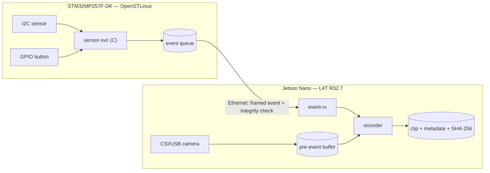

# Project: Event-triggered edge capture — STM32MP257F-DK + Jetson Nano
Status: Planned — chưa có code/evidence. Scope bên dưới là đề xuất; chốt ở M0.

## Problem and users
Thiết bị hiện trường (camera an ninh, body camera, máy công nghiệp) cần lưu đoạn video trước và sau một sự kiện, kèm timestamp tin cậy và bằng chứng toàn vẹn dữ liệu.
Project tách vai trò: STM32MP257F-DK phát hiện sự kiện từ sensor/GPIO; Jetson Nano giữ buffer camera và lưu clip khi nhận sự kiện.
Người dùng: kỹ sư vận hành cần clip + metadata để điều tra sự cố.
Lý do làm: đi hết chuỗi Embedded Linux (peripheral → protocol → service → image → đo đạc) trên hai BSP khác nhau.

## Scope
In scope: đọc sensor I2C + nút GPIO trên STM32MP2; giao thức event qua Ethernet; pre-event buffer và ghi clip trên Jetson; systemd service; image STM32MP2 build bằng Yocto; đo latency và test lỗi.
Out of scope: cloud upload, UI, mã hóa clip, OTA update, chứng nhận an toàn.
Stretch (chỉ làm khi core đạt gate): firmware Cortex-M33 lấy mẫu sensor + RPMsg; inference trên Jetson (TensorRT) hoặc NPU của STM32MP2; PTP thay NTP.

## Architecture (draft)


| Component | Board | Ngôn ngữ | Trách nhiệm |
| --- | --- | --- | --- |
| sensor-svc | STM32MP2 | C | Đọc sensor + GPIO, phát hiện event, giữ event khi mất link, gửi event |
| protocol | Cả hai | C | Encode/decode frame, version, kiểm tra toàn vẹn; unit test trên host |
| event-rx | Jetson | C/C++ | Nhận + validate event, ack, chuyển cho recorder |
| recorder | Jetson | C++ + GStreamer | Pre-event buffer, ghi clip, metadata, SHA-256 |
| systemd units | Cả hai | — | Khởi động, restart, logging qua journald |

## Open decisions
Chốt bằng thí nghiệm; ghi lựa chọn, phương án bị loại và evidence vào [Trade-offs](#trade-offs).

| Quyết định | Lựa chọn | Tiêu chí | Chốt ở |
| --- | --- | --- | --- |
| Sensor | Model I2C cụ thể | Có datasheet, 3.3V, dễ mua | M0 |
| Event detection | Ngưỡng sensor / GPIO edge / cả hai | False positive, latency | M1 |
| Pre-event buffer | Ring buffer frame raw / segment đã encode | RAM, CPU, độ dài pre-event | M1 |
| Transport | TCP / UDP + sequence / MQTT | Mất gói, reconnect, độ phức tạp, dependency | M2 |
| Framing + integrity | Length-prefix + CRC / COBS / khác | Phát hiện frame lỗi, resync | M2, sau lab [struct-union](../../c-cpp-foundation/struct-union/README.md) |
| Time sync | NTP (chrony) / PTP | Sai lệch đo được giữa hai board | M4 |

## Requirements
| ID | Requirement | Acceptance test | Result |
| --- | --- | --- | --- |
| R01 | sensor-svc đọc sensor theo chu kỳ cấu hình được; lỗi I/O được log và service tiếp tục chạy | Tháo dây sensor khi đang chạy → có log lỗi; cắm lại → tự phục hồi, không restart | Not run |
| R02 | Event frame có version, byte order cố định và kiểm tra toàn vẹn; decoder từ chối frame lỗi | Unit test: round-trip, frame cắt ngắn, sai CRC, version lạ | Not run |
| R03 | Khi mất link, sensor-svc giữ tối đa N event và gửi lại theo thứ tự khi kết nối lại; đếm event bị drop khi đầy | Rút cáp Ethernet trong lúc tạo event → cắm lại → so sánh sequence gửi/nhận | Not run |
| R04 | Recorder lưu clip gồm T_pre giây trước và T_post giây sau event, kèm metadata và SHA-256 | Tạo event → kiểm tra độ dài clip, metadata, `sha256sum` khớp | Not run |
| R05 | Đo latency từ GPIO edge đến khi Jetson nhận event (p50/p99) | Đo ≥ 100 event; đặt target sau lần đo đầu, không đặt trước | Not run |
| R06 | Cả hai service chạy bằng systemd và tự restart khi crash | `kill -9` → service chạy lại; event đã ack không bị mất | Not run |
| R07 | Build tái hiện từ clean checkout: sensor-svc cross compile bằng SDK, phía Jetson build native | Clean clone → làm theo README → binary chạy được trên board | Not run |
| R08 | Metadata ghi chênh lệch đồng hồ giữa hai board tại thời điểm event | So sánh với phép đo độc lập | Not run |

## Milestones
| Milestone | Dự kiến | Output | Gate | Liên kết |
| --- | --- | --- | --- | --- |
| M0 Scope + bring-up | 12/2026–01/2027 | Boot log hai board, console, ping qua Ethernet, chọn sensor/camera | Tái hiện boot từ README | [STM32MP2](../../hardware/boards/stm32mp257f-dk.md), [Jetson](../../hardware/boards/jetson-nano.md) |
| M1 Peripheral | 01–02/2027 | sensor-svc đọc I2C + GPIO (cross compile); Jetson capture camera + prototype pre-event buffer | Lab I2C/GPIO Done | [hardware labs](../../hardware/README.md) |
| M2 Protocol + link | 02/2027 | Thư viện protocol + unit test; sender/receiver; xử lý mất link (R02, R03) | Test lỗi tái hiện được | [error-handling](../../c-cpp-foundation/error-handling/README.md) |
| M3 Service + image | 03–04/2027 | systemd units; image STM32MP2 bằng Yocto có sensor-svc (R06, R07) | Clean build + restart test có log | [roadmap](../../ROADMAP.md) |
| M4 Integration + đo đạc | 05/2027 | Recorder hoàn chỉnh, time sync, latency, test matrix (R04, R05, R08) | Người khác làm theo được | — |
| M5 Portfolio | 06/2027 | Demo video, architecture doc, interview narrative | Kể được trade-off + 1 debug story | [livecoding](../../livecoding/README.md) |

## Planned layout
Tạo folder khi bắt đầu milestone tương ứng; không tạo folder rỗng trước.
```text
projects/stm32mp257f-dk_jetson-nano/
├── README.md        # project report (file này)
├── common/          # protocol encode/decode + unit tests (M2)
├── mp2/             # sensor-svc, build cho SDK, systemd unit (M1–M3)
├── jetson/          # event-rx, recorder, systemd unit (M1–M4)
├── yocto/           # layer/recipe cho image STM32MP2 (M3)
├── tests/           # test matrix, script đo latency (M2–M4)
├── debug/           # debug report theo templates/debug-report.md
└── evidence/        # log, số đo đã rà soát
```

## Evidence
Tên file: `YYYY-MM-DD_<board>_<topic>_<case>.txt` (hoặc `.log` / `.png`), ví dụ `2027-01-10_mp2_boot_sdcard.log`.
Mỗi evidence ghi timestamp + timezone, board + revision, image/kernel, lệnh, source commit.
Image OS, SDK, video clip lớn: ghi checksum và nơi lưu, không commit file.

## Trade-offs
Ghi khi chốt từng open decision: lựa chọn, phương án bị loại, lý do, evidence.
TODO

## Build and run
Host/board/image/toolchain versions; dependencies; exact commands; expected output:
TODO

## Tests
Normal / boundary / error / recovery; test-to-requirement mapping; evidence:
TODO

## Debugging and performance
Issue, hypothesis, measurement, fix, retest:
TODO

## Demo
Commit + video/log + cách tái hiện:
TODO

## Limitations
Known issues và phần chưa được kiểm chứng:
- Jetson Nano bị giới hạn ở JetPack 4.6 (Ubuntu 18.04, GCC 7); code dùng chung phải build được bằng toolchain này.

## Interview narrative
Problem → constraints → decision → evidence → lesson:
TODO
