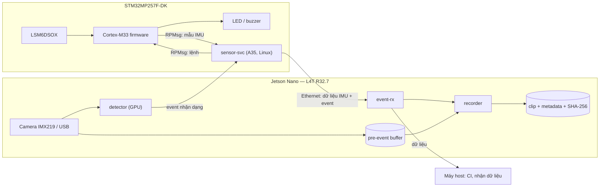

# Project: Edge sensor + camera — STM32MP257F-DK + Jetson Nano
Status: Planned — chưa có code/evidence. Scope bên dưới là đề xuất; mỗi quyết định được chốt bằng một [ADR](../../docs/adr/README.md).

## Problem and users
Thiết bị hiện trường cần ghi lại video quanh một sự kiện chuyển động (rung, rơi), với timestamp đồng bộ giữa các node, dữ liệu toàn vẹn và chịu được mất điện đột ngột.
STM32MP257F-DK là node real-time: Cortex-M33 lấy mẫu LSM6DSOX và điều khiển LED/buzzer; Linux trên Cortex-A35 chạy service phát hiện sự kiện và gửi dữ liệu.
Jetson Nano là gateway và lo phần camera: nhận dữ liệu qua Ethernet, giữ buffer video trước sự kiện, ghi clip bằng encoder phần cứng, nhận dạng bằng GPU.
Người dùng: kỹ sư vận hành cần clip + dữ liệu chuyển động để điều tra sự cố.

## Các phần và thời gian
| Phần | Thời gian | Nội dung | Output |
| --- | --- | --- | --- |
| Nền BSP + driver | 11/2026–03/2027 | Boot, U-Boot, device tree, kernel; LSM6DSOX qua I2C/SPI/IIO; driver IIO tự viết; image Yocto | Cổng 1 trong [roadmap](../../ROADMAP.md#hai-cổng) |
| Mini project 1 — Network | 04/2027 | MP257F gửi dữ liệu LSM6DSOX sang Jetson rồi về máy host; TCP và UDP, đánh giá MQTT (Mosquitto trên Jetson); đo độ trễ và mất gói bằng Wireshark; thêm TLS | Báo cáo latency/loss; ADR transport |
| Mini project 2 — Camera | 05/2027 | Pipeline GStreamer có encoder phần cứng; video + dữ liệu chuyển động đồng bộ timestamp; sự kiện rung/rơi kích hoạt ghi clip có pre-event; event nhận dạng từ Jetson bật LED/buzzer trên MP257F | Clip + metadata + SHA-256 |
| Tích hợp + độ bền | 06/2027 | Firmware M33 lấy mẫu LSM6DSOX, gửi lên Linux qua RPMsg; OTA A/B; watchdog; test rút nguồn; CI deploy lên hai board; README + video demo | Cổng 2 |
| Mở rộng | 07–09/2027 | Secure boot, ký firmware, threat model (STRIDE); model AI trên GPU Jetson hoặc NPU MP257F có số đo | Threat model, báo cáo đo |

## Architecture (draft)

Trước 06/2027, sensor-svc đọc LSM6DSOX trực tiếp qua driver IIO trên Linux; firmware M33 thay phần lấy mẫu ở bước tích hợp.

| Component | Board | Ngôn ngữ | Trách nhiệm |
| --- | --- | --- | --- |
| sensor firmware | MP257F (M33) | C, STM32CubeMP2 | Lấy mẫu LSM6DSOX real-time, điều khiển LED/buzzer, RPMsg |
| sensor-svc | MP257F (A35) | C/C++ | Nhận mẫu (IIO hoặc RPMsg), phát hiện sự kiện, gửi dữ liệu/event, giữ event khi mất link |
| protocol | Cả hai | C | Encode/decode frame, version, kiểm tra toàn vẹn; unit test trên host |
| event-rx | Jetson | C/C++ | Nhận + validate, ack, chuyển cho recorder, forward về host |
| recorder | Jetson | C++ + GStreamer | Pre-event buffer, encode phần cứng, ghi clip, metadata, SHA-256 |
| detector | Jetson | jetson-inference | Nhận dạng trên GPU, gửi event về MP257F |
| systemd units + watchdog | Cả hai | — | Khởi động, restart, watchdog, logging qua journald |
| CI | Máy host | — | Unit test, cross compile build, deploy lên hai board |

## Open decisions
Mỗi quyết định viết thành một ADR (bối cảnh, phương án, lựa chọn, lý do, hệ quả) trong [docs/adr](../../docs/adr/README.md).

| Quyết định | Lựa chọn | Tiêu chí | Chốt ở |
| --- | --- | --- | --- |
| Transport dữ liệu IMU | TCP / UDP + sequence / MQTT | Độ trễ, mất gói, reconnect, dependency | 04/2027 |
| Framing + integrity | Length-prefix + CRC / COBS / payload MQTT | Phát hiện frame lỗi, resync; sau lab [struct-union](../../c-cpp-foundation/struct-union/README.md) | 04/2027 |
| Bảo mật kênh | TLS server-only / mutual TLS (client certificate) | Mức xác thực, chi phí CPU | 04/2027 |
| Ngôn ngữ service | C++ / Go | Hiệu năng, thư viện, toolchain trên JetPack 4.6 | 04/2027 |
| Encode video | H.264 phần cứng / phần mềm | CPU, độ trễ, chất lượng | 05/2027 |
| Pre-event buffer | Frame raw / segment đã encode | RAM, độ dài pre-event | 05/2027 |
| Time sync | NTP (chrony) / PTP | Sai lệch đo được giữa hai board | 05/2027 |
| OTA | RAUC / SWUpdate | Tích hợp Yocto, rollback | 06/2027 |

## Requirements
| ID | Requirement | Acceptance test | Result |
| --- | --- | --- | --- |
| R01 | sensor-svc đọc LSM6DSOX với ODR cấu hình được (mặc định 104 Hz); lỗi I/O được log và service tiếp tục chạy | Tháo dây sensor khi đang chạy → có log lỗi; cắm lại → tự phục hồi, không restart | Not run |
| R02 | Frame dữ liệu/event có version, byte order cố định và kiểm tra toàn vẹn; decoder từ chối frame lỗi | Unit test: round-trip, frame cắt ngắn, sai CRC, version lạ | Not run |
| R03 | Khi mất link, sensor-svc giữ tối đa N event và gửi lại theo thứ tự; đếm event bị drop khi đầy | Rút cáp Ethernet trong lúc tạo event → cắm lại → so sánh sequence gửi/nhận | Not run |
| R04 | Đo độ trễ và tỉ lệ mất gói MP257F → Jetson cho TCP và UDP | Wireshark capture + script thống kê; ghi p50/p99 và tỉ lệ mất gói | Not run |
| R05 | Kênh dữ liệu được mã hoá TLS theo ADR | Kết nối với certificate sai bị từ chối | Not run |
| R06 | Sự kiện rung/rơi kích hoạt ghi clip gồm T_pre giây trước và T_post giây sau, kèm metadata (timestamp, dữ liệu IMU) và SHA-256 | Tạo event → kiểm tra độ dài clip, metadata, `sha256sum` khớp | Not run |
| R07 | Đo latency từ cạnh INT1 của LSM6DSOX đến khi Jetson nhận event | Đo ≥ 100 event; đặt target sau lần đo đầu, không đặt trước | Not run |
| R08 | Metadata ghi chênh lệch đồng hồ giữa hai board tại thời điểm event | So sánh với phép đo độc lập | Not run |
| R09 | Event nhận dạng từ Jetson bật LED/buzzer trên MP257F | Đo độ trễ từ frame có đối tượng đến khi LED bật | Not run |
| R10 | Service chạy bằng systemd có watchdog, tự restart khi treo hoặc crash | `kill -9` và treo giả lập → service chạy lại; event đã ack không mất | Not run |
| R11 | Mất điện khi đang ghi không làm hỏng clip đã đóng | Rút nguồn 500 lần khi đang ghi; đếm file hỏng; mục tiêu 0 | Not run |
| R12 | OTA A/B có rollback | Cài bản lỗi cố ý → tự rollback về bản trước | Not run |
| R13 | Firmware M33 lấy mẫu LSM6DSOX real-time và gửi lên Linux qua RPMsg | So sánh jitter lấy mẫu giữa M33 và Linux | Not run |
| R14 | Build tái hiện + CI: unit test và cross compile build xanh; người khác clone và chạy theo README | CI log + thử trên máy sạch | Not run |

## Checklist Cổng 2 (06/2027)
- [ ] README tiếng Anh, sơ đồ kiến trúc, video demo
- [ ] CI chạy unit test và build cross compile
- [ ] 8–10 ADR trong [docs/adr](../../docs/adr/README.md)
- [ ] 10 bản ghi root cause trong [debug-logs](../../debug-logs/README.md)
- [ ] Báo cáo test rút nguồn khi đang ghi (R11)
- [ ] Sau đó: threat model (07/2027), 1 patch gửi upstream Linux kernel, U-Boot hoặc Zephyr (09/2027)

## Planned layout
Tạo folder khi bắt đầu phần tương ứng; không tạo folder rỗng trước.
```text
projects/stm32mp257f-dk_jetson-nano/
├── README.md        # project report (file này)
├── common/          # protocol encode/decode + unit tests
├── mp2/             # sensor-svc, firmware M33, systemd unit
├── jetson/          # event-rx, recorder, detector, systemd unit
├── yocto/           # layer/recipe cho image STM32MP2
├── tests/           # test matrix, script đo latency, test rút nguồn
├── debug/           # debug report theo templates/debug-report.md
└── evidence/        # log, số đo đã rà soát
```

## Evidence
Tên file: `YYYY-MM-DD_<board>_<topic>_<case>.txt` (hoặc `.log` / `.png`), ví dụ `2026-11-07_mp2_boot_sdcard.log`.
Mỗi evidence ghi timestamp + timezone, board + revision, image/kernel, lệnh, source commit.
Image OS, SDK, video clip lớn: ghi checksum và nơi lưu, không commit file.

## Build and run
Host/board/image/toolchain versions; dependencies; exact commands; expected output:
TODO

## Tests
Normal / boundary / error / recovery; test-to-requirement mapping; evidence:
TODO

## Debugging and performance
Issue, hypothesis, measurement, fix, retest:
TODO

## Demo
Commit + video/log + cách tái hiện:
TODO

## Limitations
Known issues và phần chưa được kiểm chứng:
- Jetson Nano bị giới hạn ở JetPack 4.6 (Ubuntu 18.04, GCC 7); code dùng chung phải build được bằng toolchain này.
- Jetson Nano không có Wi-Fi sẵn: hai board và máy host nối chung switch Ethernet.
- Camera Raspberry Pi v3 không được hỗ trợ sẵn trên JetPack 4.6; dùng camera v2 (IMX219) hoặc webcam USB.

## Project narrative
Problem → constraints → decision → evidence → lesson:
TODO
