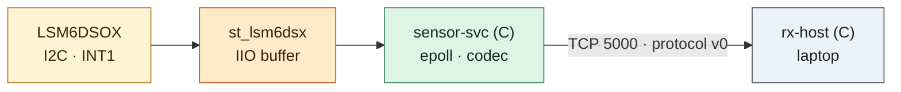
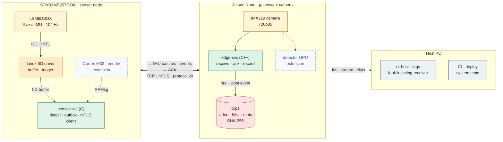
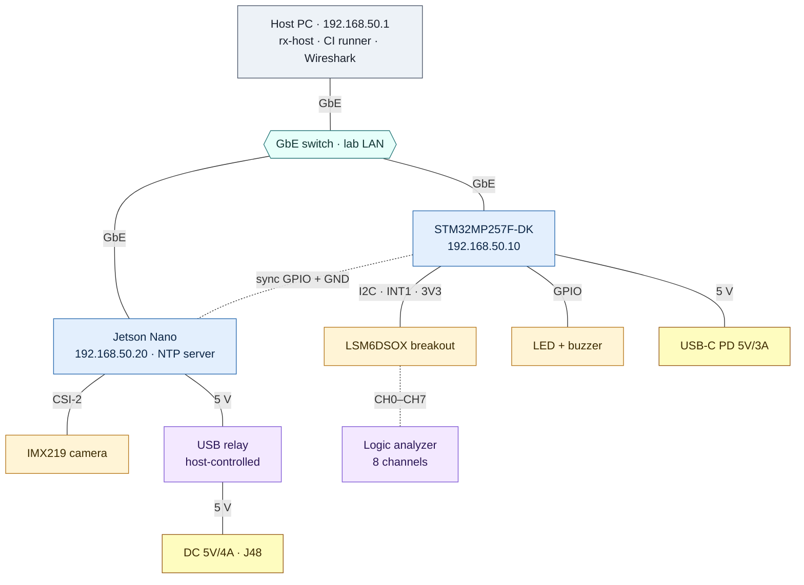
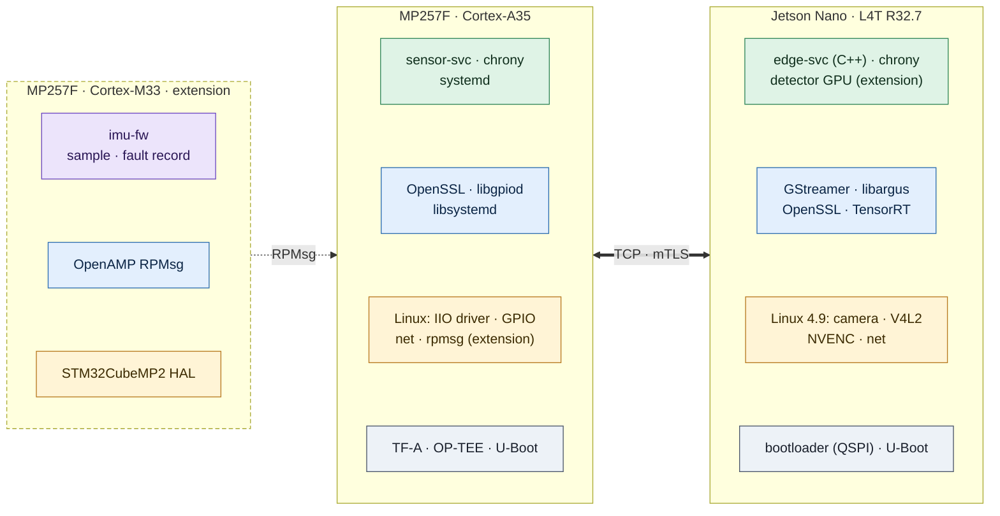
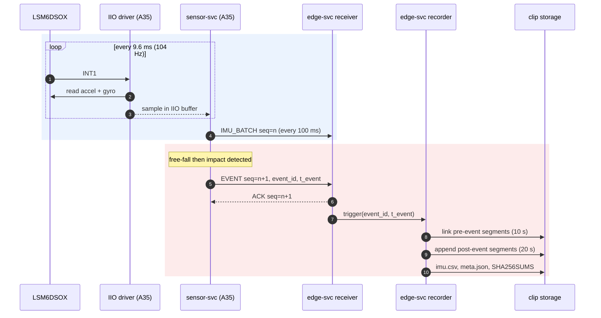
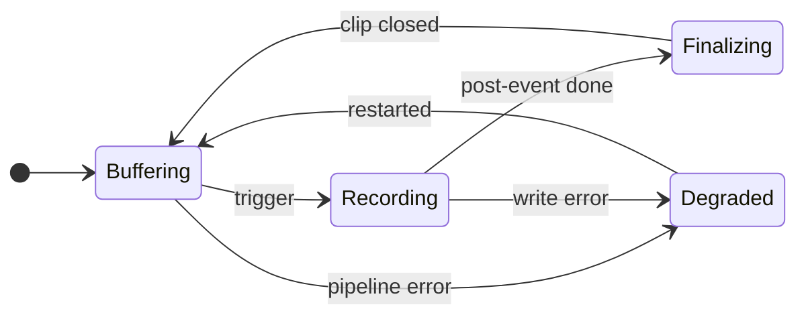
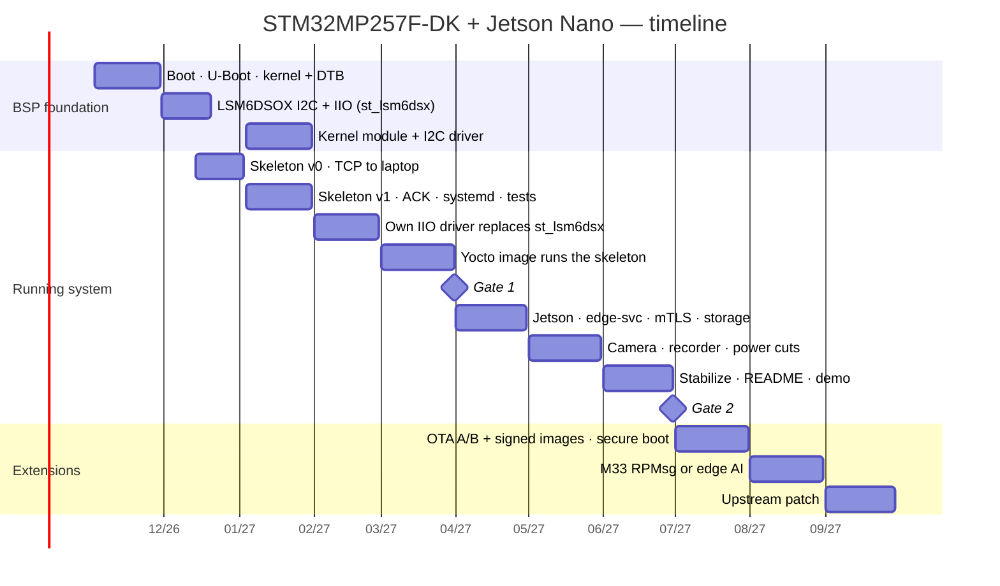

# Project: Edge sensor + camera — STM32MP257F-DK + Jetson Nano
Status: Planned — chưa có code/evidence. Thiết kế bên dưới là bản nháp; mỗi quyết định được chốt bằng một [ADR](../../docs/adr/README.md), mỗi con số là giả định cho tới khi có phép đo.

Tài liệu chi tiết: [Hardware & wiring](docs/hardware.md) · [Protocol v0](docs/protocol.md) · [Software design](docs/software-design.md) · [Test plan](docs/test-plan.md) · [Threat model](docs/threat-model.md)

Mục lục: [Problem](#problem-and-users) · [Thông số chính](#thông-số-chính) · [Walking skeleton](#walking-skeleton) · [Architecture](#architecture) · [Interfaces](#interfaces) · [Budgets](#budgets-và-ước-lượng) · [Open decisions](#open-decisions) · [Requirements](#requirements) · [Milestones](#milestones) · [Risks](#risks) · [Demo](#demo)

## Problem and users
Thiết bị hiện trường cần ghi lại video quanh một sự kiện chuyển động (rung, va đập, rơi), với timestamp đồng bộ giữa các node, dữ liệu toàn vẹn và chịu được mất điện đột ngột.
STM32MP257F-DK là node cảm biến: Linux trên Cortex-A35 đọc LSM6DSOX qua driver IIO, sensor-svc (C) phát hiện sự kiện và gửi dữ liệu. Cortex-M33 lấy mẫu real-time là phần mở rộng sau Cổng 2.
Jetson Nano là gateway và lo phần camera: edge-svc (C++) nhận dữ liệu qua Ethernet, giữ buffer video trước sự kiện và ghi clip bằng encoder phần cứng. Nhận dạng bằng GPU là phần mở rộng.
Người dùng: kỹ sư vận hành cần clip + dữ liệu chuyển động đồng bộ để điều tra sự cố.

### Scope theo mức ưu tiên
| Mức | Nội dung |
| --- | --- |
| Must — đường chính, bắt buộc cho Cổng 2 | Đọc IMU qua IIO + phát hiện sự kiện trên Linux (R01); protocol có kiểm tra toàn vẹn (R02); chịu mất kết nối, receiver chậm, partial I/O, shutdown (R03, R20, R21); đo latency/mất mẫu bằng một script dùng lại (R04, R07); mTLS (R05); clip pre/post-event + SHA-256 (R06); đồng bộ đồng hồ có số đo (R08); watchdog và restart (R10); chịu mất điện (R11); build tái hiện + CI (R14); storage đầy (R15); health counter (R16); không lộ dữ liệu định danh (R17); least privilege (R18); threat model (R19) |
| Mở rộng — sau khi đường chính ổn định | OTA A/B kèm kiểm chữ ký image (R12); firmware M33 + RPMsg (R13); secure boot, dm-verity |
| Could | Detector GPU → LED/buzzer (R09); so sánh UDP với TCP; MQTT; stream RTSP; Bluetooth LE |
| Won't (lúc này) | Cloud upload, UI, mã hóa clip, chứng nhận an toàn |

Khi thiếu thời gian, cắt từ dưới lên: Could → Mở rộng. Must không bị cắt: nếu trễ thì dời mốc và ghi lý do trong monthly review.

## Thông số chính
Giá trị thiết kế ban đầu; chỉnh theo số đo và ghi lại lý do trong ADR.

| Thông số | Giá trị | Liên quan |
| --- | --- | --- |
| IMU | LSM6DSOX, ODR 104 Hz, accel ±16 g, gyro ±2000 dps | R01, [hardware](docs/hardware.md) |
| Bus cảm biến | I2C 400 kHz (địa chỉ 0x6A), INT1; SPI ≤ 10 MHz là phần mở rộng | HW04, HW05 |
| Driver | `st_lsm6dsx` có sẵn (12/2026–01/2027), driver IIO tự viết từ 02/2027 | KN09 |
| Gửi dữ liệu IMU | Batch 100 ms (~10 mẫu); event gửi ngay, không chờ batch | [protocol](docs/protocol.md) |
| Receiver | rx-host trên laptop (12/2026–03/2027), edge-svc trên Jetson từ 04/2027; TCP 5000, mTLS từ 04/2027 | NW01, NW05 |
| Pre-event / post-event | 10 s / 20 s; trigger lặp lại thì kéo dài, tối đa 60 s mỗi clip | R06 |
| Video | 1280×720 @ 30 fps, H.264 phần cứng ~4 Mbit/s, GOP 1 s | VD03, VD04 |
| Segment | MPEG-TS 2 s; ring 8 segment (16 s) trong tmpfs | VD05, RL02 |
| Clip | ~15 MB cho 30 s: segment + `imu.csv` + `meta.json` + `SHA256SUMS` | R06 |
| Budget latency | ≤ 50 ms p99 từ cạnh INT1 đến khi edge-svc nhận event (target chính thức sau lần đo đầu) | R07 |
| Test mất điện | 500 lần cắt nguồn khi đang ghi, 0 clip đã đóng bị hỏng | R11 |
| Mạng lab | LAN riêng 192.168.50.0/24: host .1, MP257F .10, Jetson .20 | [hardware](docs/hardware.md#mạng-lab) |

## Walking skeleton
Hệ thống chạy xuyên suốt từ 12/2026, trước khi có Jetson, camera hay TLS, để gặp sớm các vấn đề thật: partial read/write, mất kết nối, timeout, buffer đầy, shutdown. Sau đó mỗi tháng thay hoặc nâng **một** phần và đo lại bằng cùng một script, nên luôn có một hệ thống đang chạy để thấy tác động của thay đổi.


Skeleton 12/2026: driver có sẵn, một chương trình C, TCP thuần, laptop nhận dữ liệu. Chưa có Jetson, camera, TLS hay ACK.

| Tháng | Thay hoặc nâng | Độ bền và bảo mật thêm cùng lúc | Đo lại |
| --- | --- | --- | --- |
| 12/2026 | Skeleton v0: `st_lsm6dsx` → sensor-svc → TCP → rx-host | Threat model v0 và spec một trang viết trước khi code; sensor-svc không chạy bằng root; rx-host đọc chậm hoặc ngừng đọc để gặp partial write và buffer đầy; Ctrl-C/SIGTERM tắt sạch | Baseline 1 giờ: mẫu gửi/nhận/mất, latency INT1 → rx-host, CPU, RSS |
| 01/2027 | Skeleton v1: CRC + ACK + outbox, reconnect có backoff, systemd + watchdog | Test crash (`kill -9`), treo (`kill -STOP`), timeout, mất kết nối, cleanup fd/bộ nhớ; user riêng + sandboxing; fuzz decoder bắt đầu | Cùng script; thêm thời gian phục hồi sau lỗi |
| 02/2027 | Driver IIO tự viết thay `st_lsm6dsx` | Unbind/bind và rút dây cảm biến khi service đang chạy | Số ngắt/s, CPU, latency mẫu → user space: FIFO watermark của `st_lsm6dsx` so với data-ready từng mẫu |
| 03/2027 | Image Yocto riêng: driver, sensor-svc, unit systemd, udev rule | `systemd-analyze security` trong image; build lại sạch cho cùng image | Thời gian boot đến khi service sẵn sàng; cùng script |
| 04/2027 | edge-svc (C++) trên Jetson thay rx-host; mTLS | edge-svc bắt đầu ghi dữ liệu nên có ngay test đầy ổ đĩa và cắt nguồn; cập nhật threat model | Latency qua mTLS so với TCP thuần; CPU của TLS |
| 05/2027 | Camera + recorder trong edge-svc | 500 lần cắt nguồn khi đang ghi; SHA-256 cho clip; test 24 giờ | Latency INT1 → edge-svc, lệch đồng hồ, dung lượng clip |
| 06/2027 | Không thêm tính năng: ổn định, README, demo (Cổng 2) | Chạy lại toàn bộ test plan từ clean clone | Báo cáo so sánh với baseline 12/2026 |
| 07/2027 | Mở rộng: OTA A/B | Image được ký; image sai chữ ký bị từ chối và image lỗi tự rollback ngay trong milestone này | Thời gian cập nhật, thời gian rollback |
| 08/2027 | Mở rộng: imu-fw trên M33 qua RPMsg (hoặc detector GPU) | Fault record của M33 giữ qua reset | Jitter lấy mẫu M33 so với đường IIO |

Quy tắc:
- Trước khi thay một phần: chạy script đo, lưu baseline vào `evidence/`. Sau khi thay: chạy lại cùng script, ghi chênh lệch vào milestone và ADR liên quan.
- Mỗi tháng giữ một tag chạy được (ví dụ `skeleton-2027-01`). Bước mới làm hệ thống không chạy quá một tuần thì quay về tag trước và chia nhỏ bước.
- Test của bước trước phải vẫn pass ở bước sau; test được thêm vào [test plan](docs/test-plan.md) ngay khi tính năng xuất hiện, không đợi giai đoạn tích hợp.

## Architecture
Bản nháp cho trạng thái Cổng 2 (06/2027). Phần mở rộng (M33/RPMsg, detector GPU) vẽ bằng viền đứt: thiếu chúng hệ thống vẫn đủ cho Cổng 2.

### System overview

Màu: vàng = phần cứng · cam = kernel driver · xanh lá = service · đỏ = dữ liệu lưu trữ · xám = máy host · viền đứt = phần mở rộng.
Mũi tên đậm hai chiều là kênh chính giữa hai board: chiều đi mang mẫu IMU và event, chiều về mang ACK.

### Physical setup

Console: ST-LINK qua USB-C cho MP257F, USB-UART 3.3 V cho Jetson. Relay trên dây 5 V của Jetson do host điều khiển qua USB, dùng cho test mất điện (R11).
Sơ đồ chân, mạch LED/buzzer, map kênh logic analyzer và kế hoạch IP: [docs/hardware.md](docs/hardware.md).

### Software stack

Mỗi cột xếp từ trên xuống: ứng dụng (xanh lá) · thư viện (xanh dương) · kernel hoặc HAL (vàng) · boot (xám). Cột M33 viền đứt là phần mở rộng.
Image MP257F build bằng Yocto (Distribution Package) từ 03/2027; Jetson dùng JetPack 4.6 và cài edge-svc như package riêng. Chi tiết từng service: [docs/software-design.md](docs/software-design.md).

### Event flow

Event chưa nhận ACK nằm trong outbox của sensor-svc và được gửi lại sau khi kết nối lại (R03). Định dạng frame, ACK và gửi lại: [docs/protocol.md](docs/protocol.md).

### Recorder state machine
Recorder là một module của edge-svc (process riêng hay không: quyết định trong [open decisions](#open-decisions)).



| State | Ý nghĩa |
| --- | --- |
| Buffering | Pipeline chạy, ring giữ 8 segment × 2 s gần nhất trong tmpfs; chưa ghi gì xuống storage |
| Recording | Đã copy segment pre-event và đang copy segment mới; trigger lặp lại thì kéo dài post-event, tối đa 60 s |
| Finalizing | Ghi `imu.csv`, `meta.json`, `SHA256SUMS`, fsync rồi rename `.partial` thành clip hoàn chỉnh |
| Degraded | Camera, encoder hoặc storage lỗi: báo trong HEARTBEAT, khởi động lại pipeline; quá 3 lần liên tiếp thì thoát để systemd restart edge-svc |

State machine của link và detector: [docs/software-design.md](docs/software-design.md#state-machines).

### Components
| Component | Board | Ngôn ngữ | Trách nhiệm | Từ | Topic liên quan |
| --- | --- | --- | --- | --- | --- |
| IIO driver | MP257F (A35) | C (kernel) | `st_lsm6dsx` có sẵn trong skeleton; driver tự viết (buffer + trigger data-ready) thay thế từ 02/2027 | 12/2026 | KN03, KN06, KN08, KN09 |
| sensor-svc | MP257F (A35) | C11 | Đọc IIO buffer, phát hiện sự kiện, outbox, codec, TCP → mTLS, heartbeat, watchdog; không chạy bằng root | 12/2026 | CC11, CC12, LS08, NW01, NW05, RL01, RL05, HW08, SC07 |
| protocol | Cả hai | C11, header dùng được từ C++ | Encode/decode frame, CRC-32; unit test + fuzz trên host | 12/2026 | CC05, CC09, CC17, TS01, TS06 |
| rx-host | Host | C11 | Receiver của skeleton; sau đó là receiver kiểm thử có chế độ lỗi: đọc chậm, ngừng đọc, ngắt giữa frame | 12/2026 | NW01, TS07 |
| edge-svc | Jetson | C++17 | Receiver (validate, ACK, chống trùng), lưu dữ liệu IMU, recorder GStreamer (ring, clip, metadata, SHA-256, retention), health counter | 04/2027 | CC14, CC17, TS02, NW05, VD03–VD05, VD07, RL02, RL07, LS09, SC06 |
| systemd units | Cả hai | — | Restart, watchdog, user riêng, sandboxing, journald | 01/2027 | RL01, RL04, SC07 |
| meta-edgecap | MP257F | Yocto | Recipe cho driver, sensor-svc, unit systemd, udev rule và bản vá device tree | 03/2027 | YC01, YC02, YC04 |
| time sync | Cả hai | chrony | Jetson là NTP server của LAN, MP257F là client; đo lệch bằng sync GPIO | 05/2027 | VD07, R08 |
| CI | Host | GitHub Actions | Unit test, build cross compile, test trên board qua SSH/serial | 11/2026 | TS03, TS04 |
| OTA *(mở rộng)* | MP257F | RAUC hoặc SWUpdate | A/B, kiểm chữ ký image, rollback | 07/2027 | RL03, SC03 |
| imu-fw *(mở rộng)* | MP257F (M33) | C, STM32CubeMP2 | Lấy mẫu real-time, gửi qua RPMsg; so jitter với đường IIO | 08/2027 | MC01–MC04, AR06 |
| detector GPU *(mở rộng)* | Jetson | C++, TensorRT / jetson-inference | Nhận dạng trên GPU; số đo latency, điện năng, nhiệt | 08/2027 | PW03 |

Ngôn ngữ: C cho driver, sensor-svc, protocol và rx-host; một service C++ (edge-svc) cho phần application; Python chỉ cho script test và đo.

## Interfaces
| ID | Từ → đến | Transport | Định dạng | Tần suất / kích thước |
| --- | --- | --- | --- | --- |
| IF1 | LSM6DSOX → IIO driver | I2C 400 kHz + INT1 | Register | 104 Hz × 12 byte |
| IF2 | IIO driver → sensor-svc | `/dev/iio:deviceN` + sysfs | Scan element: 3 trục accel, 3 trục gyro (int16), timestamp (int64) | 104 Hz |
| IF3 | sensor-svc → rx-host (12/2026–03/2027), edge-svc (từ 04/2027) | TCP 5000, mTLS từ 04/2027 | Frame protocol v0 | ~10 frame/s + event |
| IF4 | edge-svc → sensor-svc | Cùng kết nối IF3 | ACK, HEARTBEAT | Theo frame |
| IF5 | camera → edge-svc | CSI-2 + libargus | NV12 trong NVMM | 1280×720 @ 30 fps |
| IF6 | thiết bị → host | SSH, journald, TCP | Log, IMU stream | Liên tục |
| IF7 *(mở rộng)* | imu-fw → sensor-svc | RPMsg (`/dev/rpmsg*`) | Frame protocol v0 | Batch 100 ms + event tức thời |
| IF8 *(could)* | sensor-svc → edge-svc | UDP 5001 | Frame protocol v0, một frame mỗi datagram | ~10 datagram/s |

`st_lsm6dsx` tạo IIO device riêng cho accel và gyro và đẩy mẫu theo FIFO watermark (kiểm lại trên kernel của OpenSTLinux): sensor-svc của skeleton phải đọc hai device và ghép theo timestamp. Driver tự viết gộp sáu kênh vào một device; sự khác biệt này là một phần của số đo 02/2027.
Cổng, địa chỉ và hostname: [docs/hardware.md](docs/hardware.md#mạng-lab).

## Budgets và ước lượng
### Latency (budget ban đầu, p99)
| Đoạn | Budget | Đo bằng |
| --- | --- | --- |
| INT1 → mẫu vào IIO buffer (driver tự viết, data-ready) | 2 ms | Logic analyzer: INT1 so với bus I2C |
| Mẫu kích hoạt → sensor-svc quyết định event | 10 ms | Timestamp trong log; replay dữ liệu đã ghi |
| sensor-svc → edge-svc (LAN, TCP + mTLS) | 10 ms | Timestamp hai phía sau khi đồng bộ đồng hồ |
| edge-svc receiver → recorder trigger | 5 ms | Log cùng process |
| **Tổng INT1 → edge-svc nhận event** | **≤ 50 ms** | Logic analyzer: INT1 (CH4) so với GPIO Jetson do edge-svc bật (CH7), cùng một thang thời gian |

Với `st_lsm6dsx`, mẫu đến user space theo lô FIFO nên latency phụ thuộc watermark; skeleton đo con số này làm baseline trước khi thay driver. Phần mở rộng M33 dùng cùng phép đo để so với đường IIO.

### Dữ liệu và lưu trữ
| Đại lượng | Công thức | Kết quả |
| --- | --- | --- |
| IMU thô | 104 mẫu/s × 12 byte | ≈ 1.25 kB/s |
| IMU qua mạng | 10 batch/s × (24 byte frame + 14 byte header batch + 120 byte mẫu) | ≈ 1.6 kB/s |
| Video | 4 Mbit/s ÷ 8 | 0.5 MB/s |
| Ring trong tmpfs | 16 s × 0.5 MB/s | ≈ 8 MB RAM |
| Một clip 30 s | 30 s × 0.5 MB/s | ≈ 15 MB |
| Ghi liên tục 1 giờ | 3600 s × 0.5 MB/s | ≈ 1.8 GB |

## Open decisions
Mỗi quyết định viết thành một ADR (bối cảnh, phương án, lựa chọn, lý do, hệ quả) trong [docs/adr](../../docs/adr/README.md).

| Quyết định | Lựa chọn | Tiêu chí | Chốt ở |
| --- | --- | --- | --- |
| Ngôn ngữ của service | **Đã chọn:** C cho sensor-svc, protocol, rx-host; C++17 cho edge-svc; không thêm ngôn ngữ khác | Trục chính là Linux/BSP; một service C++ thực tế đủ củng cố phần application | ADR đầu tiên, 12/2026 |
| User và quyền chạy service | User riêng + group `edgecap` + udev rule / thêm Linux capabilities | Least privilege theo [threat model](docs/threat-model.md) | 12/2026 |
| Framing + integrity | Length-prefix + CRC-32 (protocol v0) / COBS | Phát hiện frame lỗi, resync; sau lab [struct-union](../../c-cpp-foundation/struct-union/README.md) | 12/2026 |
| Nơi phát hiện sự kiện | Chức năng free-fall/wake-up có sẵn của LSM6DSOX / sensor-svc trên Linux | Latency, độ linh hoạt khi chỉnh ngưỡng, độ khó | 01/2027 |
| Nguồn mẫu IIO | `st_lsm6dsx` (FIFO, hai device) / driver tự viết (data-ready, một device) | Số ngắt/s, CPU, latency, độ phức tạp của sensor-svc | 02/2027 |
| Transport dữ liệu IMU | TCP (dùng từ skeleton) / UDP + sequence / MQTT | Độ trễ, mất gói, reconnect, dependency; quyết định bằng số đo của NW07 | 02/2027 |
| Bảo mật kênh | Mutual TLS / TLS chỉ xác thực server | Kết quả threat model, chi phí CPU | 04/2027 |
| Nơi lưu dữ liệu và clip | microSD / SSD USB | Độ bền khi ghi liên tục, tốc độ; quyết định trước lần ghi dữ liệu đầu tiên | 04/2027 |
| Recorder trong edge-svc | Module trong process / process con chạy pipeline GStreamer | Cô lập lỗi pipeline, IPC, độ phức tạp | 05/2027 |
| Encode video | H.264 phần cứng / phần mềm | CPU, độ trễ, chất lượng | 05/2027 |
| Pre-event buffer | Ring segment MPEG-TS trong tmpfs / ring frame đã encode trong RAM | RAM, độ phức tạp, độ chính xác của T_pre | 05/2027 |
| Time sync | NTP (chrony) / PTP | Sai lệch đo được giữa hai board | 05/2027 |
| OTA *(mở rộng)* | RAUC / SWUpdate; nơi giữ khóa ký image | Tích hợp Yocto, rollback, kiểm chữ ký | 07/2027 |

## Requirements
Cột Mốc là tháng requirement phải pass lần đầu; từ đó test của nó chạy lại ở mọi bước sau.

| ID | Requirement | Acceptance test | Mốc | Result |
| --- | --- | --- | --- | --- |
| R01 | sensor-svc đọc LSM6DSOX qua IIO với ODR cấu hình được (mặc định 104 Hz); lỗi I/O được log và service tiếp tục chạy | Rút dây sensor khi đang chạy → có log lỗi; cắm lại → tự phục hồi, không restart | 01/2027 | Not run |
| R02 | Frame dữ liệu/event có version, byte order cố định và kiểm tra toàn vẹn; decoder từ chối frame lỗi | Unit test: round-trip, frame cắt ngắn, sai CRC, version lạ; fuzz không crash | 12/2026 | Not run |
| R03 | Mất kết nối, timeout hoặc receiver ngừng đọc: vòng lấy mẫu không bị block; outbox giữ tối đa 256 event và gửi lại theo thứ tự; mẫu IMU bị bỏ được đếm; bộ nhớ không tăng | Rút cáp Ethernet trong lúc tạo event; rx-host ngừng đọc 60 s → so sánh sequence gửi/nhận và counter | 01/2027 | Not run |
| R04 | Một script đo latency p50/p99, mẫu mất, CPU và RSS, chạy lại được ở mọi bước | Chạy script ở mỗi milestone; kết quả lưu cạnh baseline 12/2026 | 01/2027 | Not run |
| R05 | Kênh dữ liệu dùng mTLS; certificate sai, hết hạn hoặc sai CA bị từ chối | Kết nối với từng loại certificate sai → bị từ chối, có log | 04/2027 | Not run |
| R06 | Sự kiện kích hoạt ghi clip gồm 10 s trước và 20 s sau, kèm `imu.csv`, `meta.json` và SHA-256 | Tạo event → kiểm tra độ dài clip, metadata, `sha256sum -c` khớp | 05/2027 | Not run |
| R07 | Latency từ cạnh INT1 đến khi edge-svc nhận event ≤ 50 ms p99 (budget ban đầu) | Logic analyzer CH4 → CH7, ≥ 100 event; target chính thức đặt sau lần đo đầu | 05/2027 | Not run |
| R08 | Metadata ghi chênh lệch đồng hồ giữa hai board tại thời điểm event | So sánh với phép đo độc lập qua sync GPIO | 05/2027 | Not run |
| R09 *(could)* | Event nhận dạng từ Jetson bật LED/buzzer trên MP257F | Đo độ trễ từ frame có đối tượng đến khi LED bật | Mở rộng | Not run |
| R10 | Service chạy bằng systemd có watchdog, tự restart khi treo hoặc crash; event đã ACK không mất | `kill -9` và `kill -STOP` → service chạy lại trong ≤ WatchdogSec + RestartSec | 01/2027 (sensor-svc), 04/2027 (edge-svc) | Not run |
| R11 | Mất điện khi đang ghi không làm hỏng dữ liệu hoặc clip đã đóng | Relay cắt nguồn Jetson khi đang ghi: 100 lần từ 04/2027, 500 lần với recorder; mục tiêu 0 file hỏng | 04/2027, 05/2027 | Not run |
| R12 *(mở rộng)* | OTA A/B: image được ký; image sai chữ ký bị từ chối; image lỗi tự rollback | Cài image sai chữ ký → bị từ chối; cài image lỗi cố ý → rollback về bản trước | 07/2027 | Not run |
| R13 *(mở rộng)* | Firmware M33 lấy mẫu LSM6DSOX real-time và gửi lên Linux qua RPMsg | So sánh jitter lấy mẫu giữa M33 và đường IIO | 08/2027 | Not run |
| R14 | Build tái hiện + CI: unit test và cross compile build xanh; người khác clone và chạy theo README | CI log + thử trên máy sạch | 03/2027 (image), 06/2027 (clean clone) | Not run |
| R15 | Storage đầy: service không crash, báo trong HEARTBEAT; vượt 85% thì xóa clip cũ nhất đã được host nhận, không bao giờ xóa clip chưa được nhận | Lấp đầy storage bằng `fallocate` → kiểm tra thứ tự xóa, cảnh báo, service vẫn chạy | 04/2027 | Not run |
| R16 | Mỗi service xuất counter sức khỏe (frame, lỗi CRC, reconnect, drop, clip) qua HEARTBEAT và log | Đối chiếu counter với số lỗi tiêm vào trong test | 01/2027 | Not run |
| R17 | Log và metadata không chứa dữ liệu định danh; device ID là chuỗi ngẫu nhiên tạo khi provisioning, không dùng MAC hay serial | Rà log và metadata của một phiên test bằng script | 12/2026 | Not run |
| R18 | Least privilege: không service nào chạy bằng root; mỗi service một user riêng, chỉ có quyền thiết bị cần dùng, có systemd sandboxing | `ps -o user`, thử ghi ngoài `ReadWritePaths` bị từ chối; điểm `systemd-analyze security` ghi vào evidence | 12/2026 (không root), 01/2027 (sandboxing) | Not run |
| R19 | Threat model một trang được viết trước khi code và cập nhật ở mỗi bước của đường chính; mỗi biện pháp giảm thiểu có test tương ứng | Review [threat model](docs/threat-model.md) ở mỗi milestone; bảng mitigation ↔ test không có ô trống | 12/2026 | Not run |
| R20 | TCP có thể chia hoặc gộp frame tùy ý: partial read/write được xử lý đúng ở cả hai phía | Unit test decoder với frame bị cắt ở mọi vị trí; rx-host đọc từng byte; sensor-svc với `SO_SNDBUF` nhỏ | 12/2026 | Not run |
| R21 | Shutdown sạch: SIGTERM → dừng trong ≤ 2 s, không frame dở trên đường truyền, không rò fd hay bộ nhớ; edge-svc đóng clip đang ghi hợp lệ hoặc để lại `.partial` | `systemctl stop` lặp 100 lần; ASan/valgrind trên host; đếm fd trong `/proc/<pid>/fd` | 12/2026 (sensor-svc), 04/2027 (edge-svc) | Not run |

Ma trận test ↔ requirement: [docs/test-plan.md](docs/test-plan.md).

## Milestones


| Phần | Output | Definition of Done |
| --- | --- | --- |
| Skeleton v0 (12/2026) | sensor-svc + rx-host qua TCP; codec + unit test; threat model v0; baseline 1 giờ | R02, R17, R19, R20 Pass; R21 Pass cho sensor-svc; ADR ngôn ngữ và quyền chạy service |
| Skeleton v1 (01/2027) | ACK + outbox, systemd + watchdog, user riêng + sandboxing, script đo | R01, R03, R04, R10, R16, R18 Pass cho sensor-svc |
| Driver tự viết (02/2027) | Driver IIO thay `st_lsm6dsx`; số đo trước/sau; fuzz decoder | Mọi test trước vẫn Pass; ADR nguồn mẫu IIO và transport |
| Image Yocto (03/2027) | `meta-edgecap`; skeleton chạy trong image riêng | R14 (image) Pass; Cổng 1 trong [roadmap](../../ROADMAP.md#hai-cổng) |
| Jetson (04/2027) | edge-svc C++ nhận dữ liệu, ghi dữ liệu IMU, mTLS | R05, R15 Pass; R10, R11 (100 lần), R21 Pass cho edge-svc; threat model cập nhật |
| Camera (05/2027) | Recorder có ring + clip; metadata đồng bộ; test 24 giờ | R06, R07, R08, R11 (500 lần) Pass |
| Ổn định (06/2027) | Không thêm tính năng; README tiếng Anh, video demo; clean clone | Toàn bộ Must Pass; R14 (clean clone) Pass; Cổng 2 |
| Mở rộng (07–09/2027) | OTA kèm ký image, secure boot; M33 hoặc AI; patch upstream | R12, R13 theo phần đã chọn; RL03, SC02–SC05, KN12 ở L2 |

## Checklist Cổng 2 (06/2027)
- [ ] Đường chính IIO → sensor-svc → mTLS → edge-svc → recorder chạy từ clean clone theo README
- [ ] Toàn bộ requirement Must Pass, có evidence; báo cáo so sánh với baseline 12/2026
- [ ] Báo cáo test cắt nguồn (R11), test đầy ổ đĩa (R15), test 24 giờ
- [ ] Threat model cập nhật đến 05/2027, mỗi mitigation có test
- [ ] CI chạy unit test, fuzz ngắn và build cross compile
- [ ] Ít nhất 5 ADR cho quyết định của đường chính trong [docs/adr](../../docs/adr/README.md)
- [ ] 10 bản ghi root cause từ project trong [debug-logs](../../debug-logs/README.md)
- [ ] README tiếng Anh, sơ đồ kiến trúc, video demo
- [ ] Không yêu cầu: M33/RPMsg, OTA, detector GPU

## Risks
| Rủi ro | Ảnh hưởng | Khả năng | Giảm thiểu |
| --- | --- | --- | --- |
| Hệ thống ngừng chạy được trong lúc thay một phần | Mất khả năng đo tác động, dồn lỗi | Trung bình | Mỗi bước chỉ thay một phần; giữ tag chạy được mỗi tháng; quá một tuần không chạy thì quay về tag trước và chia nhỏ bước |
| Phần mở rộng lấn thời gian của đường chính | Trễ Cổng 2 | Trung bình | Không bắt đầu M33, OTA hay detector GPU trước khi Cổng 2 đạt; tuần thiếu thời gian bỏ lab mở rộng trước |
| Jetson Nano dừng ở JetPack 4.6 (GCC 7, glibc 2.27) | Thư viện mới không build hoặc không chạy | Cao | edge-svc giữ C++17 trong phạm vi GCC 7; build native trên Jetson hoặc container Ubuntu 18.04 arm64 |
| Camera IMX219 không nhận hoặc sai driver | Trễ phần camera | Trung bình | Thử camera ngay tuần đầu 04/2027; webcam USB dự phòng |
| microSD hỏng do ghi liên tục hoặc cắt nguồn | Mất clip, hỏng rootfs | Trung bình | Ring trong tmpfs; clip lên thẻ tốt hoặc SSD USB; theo dõi lỗi I/O; thẻ dự phòng có image đã kiểm tra |
| Yocto cần 90–100 GB và nhiều giờ build | Trễ Cổng 1 | Trung bình | Chuẩn bị SSD trước 03/2027; giữ downloads và sstate cache; skeleton vẫn chạy trên Starter Package trong lúc chờ |
| Ngưỡng phát hiện sự kiện sai: báo nhầm hoặc bỏ sót | Clip vô ích hoặc mất sự kiện | Trung bình | Ghi dữ liệu thật ≥ 20 lần mỗi loại; replay test; đo tỉ lệ báo nhầm |
| Đấu sai làm hỏng board hoặc cảm biến | Mất phần cứng | Thấp | Quy tắc an toàn trong [hardware](../../hardware/README.md#an-toàn--đọc-trước-mỗi-lab); đo 3.3V trước khi nối |
| Thời gian học thu hẹp | Trễ toàn bộ | Trung bình | Cắt Could rồi Mở rộng; Must chỉ dời mốc, có ghi lý do |

## Planned layout
Tạo folder code khi bắt đầu phần tương ứng; không tạo folder rỗng trước.
```text
projects/stm32mp257f-dk_jetson-nano/
├── README.md              # tổng quan, architecture, requirements (file này)
├── docs/                  # hardware, protocol, software design, test plan, threat model
├── common/                # protocol encode/decode + unit tests + fuzz (12/2026)
├── mp2/
│   ├── sensor-svc/        # service C trên A35 (12/2026)
│   ├── lsm6dsox-iio/      # driver IIO tự viết (02/2027)
│   ├── systemd/           # unit, udev rule, config mẫu (01/2027)
│   └── imu-fw/            # firmware Cortex-M33 (mở rộng, 08/2027)
├── host/
│   └── rx-host/           # receiver của skeleton, sau đó là receiver kiểm thử có chế độ lỗi (12/2026)
├── jetson/
│   ├── edge-svc/          # service C++: receiver, lưu dữ liệu, recorder (04/2027)
│   └── systemd/
├── yocto/meta-edgecap/    # layer: recipe driver, service, bản vá device tree (03/2027)
├── tests/                 # pytest hệ thống, script đo, fault injection, test cắt nguồn
├── debug/                 # debug report theo templates/debug-report.md
└── evidence/              # log, số đo, capture đã rà soát
```

## Evidence
Tên file: `YYYY-MM-DD_<board>_<topic>_<case>.txt` (hoặc `.log` / `.png` / `.pcapng` / `.sr`), ví dụ `2026-11-07_mp2_boot_sdcard.log`.
Mỗi evidence ghi timestamp + timezone, board + revision, image/kernel, lệnh, source commit.
Image OS, SDK, video clip lớn: ghi checksum và nơi lưu, không commit file. Capture mạng phải rà trước khi commit.

## Build and run
Kế hoạch; thay bằng lệnh thật khi có code.
1. Host: `make -C projects/stm32mp257f-dk_jetson-nano/common check` — unit test protocol (cũng chạy trong CI); build `host/rx-host` và chạy `rx-host --listen 0.0.0.0:5000`.
2. MP257F: nạp environment của SDK (`source <sdk>/environment-setup-*`), build `mp2/sensor-svc`, copy lên board, `systemctl restart sensor-svc`. Từ 03/2027 service được cài sẵn trong image Yocto.
3. Jetson (từ 04/2027): build edge-svc native trên Jetson (hoặc trong container Ubuntu 18.04 arm64 để khớp glibc 2.27), cài unit systemd, `systemctl restart edge-svc`.
4. Kiểm tra: `journalctl -u sensor-svc -u edge-svc -f`, counter trong HEARTBEAT, clip mới trong `/var/lib/edgecap/clips/`.

## Tests
Chiến lược, ma trận test ↔ requirement, fault injection và cách đo: [docs/test-plan.md](docs/test-plan.md).

## Debugging and performance
Issue, hypothesis, measurement, fix, retest — ghi trong `debug/` và liên kết vào [debug journal](../../debug-logs/README.md):
TODO

## Demo
Kịch bản video demo cho Cổng 2 (mỗi bước có log hoặc capture tương ứng):
1. Bật hai board: boot đến khi service sẵn sàng; hiển thị HEARTBEAT trên host.
2. Gõ/lắc cảm biến: clip mới xuất hiện; phát clip, mở `meta.json`, chạy `sha256sum -c`.
3. Rút cáp Ethernet trong lúc tạo 5 event, cắm lại: sequence liên tục, không mất event.
4. `kill -9 edge-svc` và `kill -STOP sensor-svc`: systemd và watchdog đưa service chạy lại, ring tiếp tục.
5. Lấp đầy storage: clip cũ nhất đã được host nhận bị xóa, service vẫn chạy và báo cảnh báo.
6. Tóm tắt kết quả 500 lần cắt nguồn, latency p50/p99 và so sánh với baseline của skeleton 12/2026.

Demo phần mở rộng (Q3/2027): image OTA sai chữ ký bị từ chối, image lỗi tự rollback.

## Limitations
Known issues và phần chưa được kiểm chứng:
- Jetson Nano bị giới hạn ở JetPack 4.6 (Ubuntu 18.04, GCC 7); code dùng chung phải build được bằng toolchain này.
- Jetson Nano không có Wi-Fi sẵn: hai board và máy host nối chung switch Ethernet.
- Camera Raspberry Pi v3 không được hỗ trợ sẵn trên JetPack 4.6; dùng camera v2 (IMX219) hoặc webcam USB.
- M33/RPMsg, OTA và detector GPU là phần mở rộng, không có trong Cổng 2.
- Mọi con số trong file này là giả định thiết kế cho tới khi có evidence.

## Retrospective
Bối cảnh → ràng buộc → quyết định → evidence → bài học:
TODO
