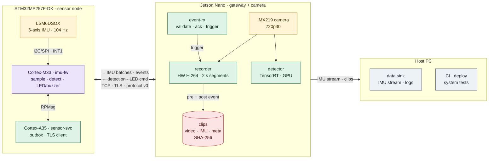
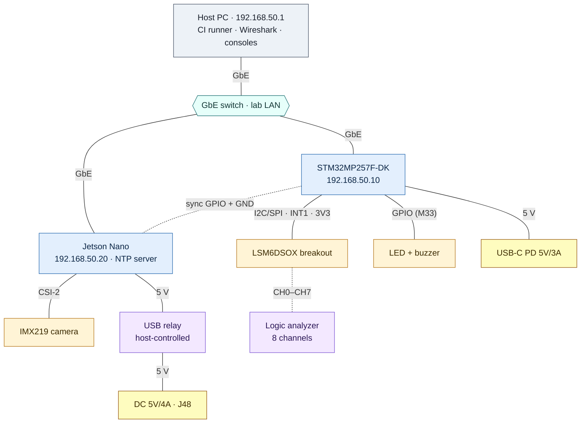
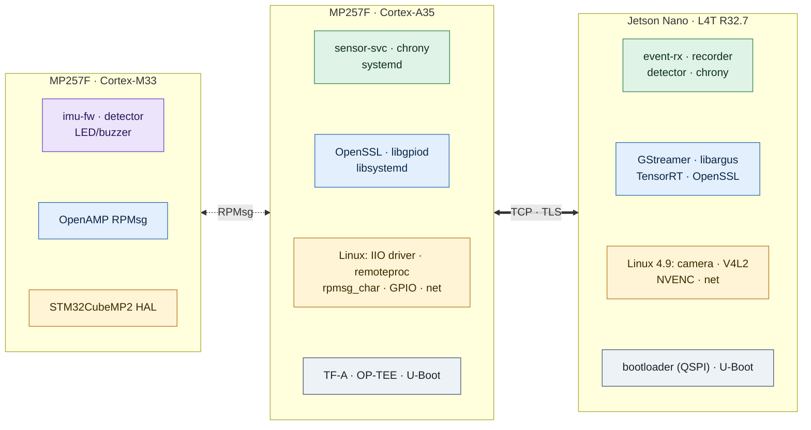
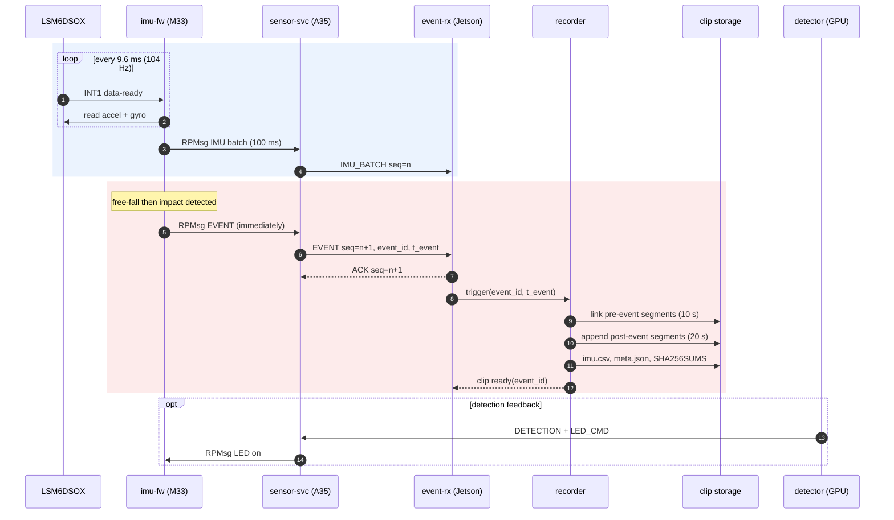
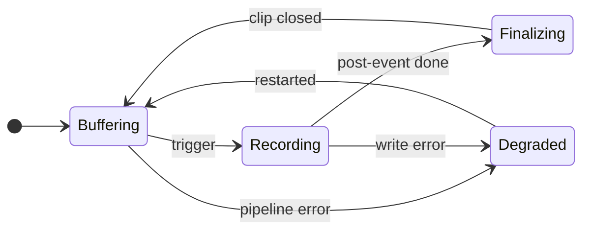
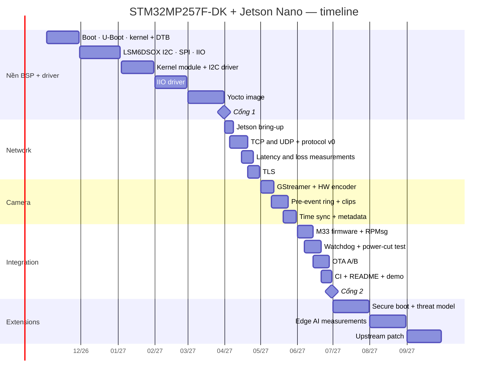

# Project: Edge sensor + camera — STM32MP257F-DK + Jetson Nano
Status: Planned — chưa có code/evidence. Thiết kế bên dưới là bản nháp; mỗi quyết định được chốt bằng một [ADR](../../docs/adr/README.md), mỗi con số là giả định cho tới khi có phép đo.

Tài liệu chi tiết: [Hardware & wiring](docs/hardware.md) · [Protocol v0](docs/protocol.md) · [Software design](docs/software-design.md) · [Test plan](docs/test-plan.md)

Mục lục: [Problem](#problem-and-users) · [Thông số chính](#thông-số-chính) · [Architecture](#architecture) · [Interfaces](#interfaces) · [Budgets](#budgets-và-ước-lượng) · [Open decisions](#open-decisions) · [Requirements](#requirements) · [Milestones](#milestones) · [Risks](#risks) · [Demo](#demo)

## Problem and users
Thiết bị hiện trường cần ghi lại video quanh một sự kiện chuyển động (rung, va đập, rơi), với timestamp đồng bộ giữa các node, dữ liệu toàn vẹn và chịu được mất điện đột ngột.
STM32MP257F-DK là node real-time: Cortex-M33 lấy mẫu LSM6DSOX, phát hiện sự kiện và điều khiển LED/buzzer; Linux trên Cortex-A35 chạy service gửi dữ liệu.
Jetson Nano là gateway và lo phần camera: nhận dữ liệu qua Ethernet, giữ buffer video trước sự kiện, ghi clip bằng encoder phần cứng, nhận dạng bằng GPU.
Người dùng: kỹ sư vận hành cần clip + dữ liệu chuyển động đồng bộ để điều tra sự cố.

### Scope theo mức ưu tiên
| Mức | Nội dung |
| --- | --- |
| Must | Đọc IMU + phát hiện sự kiện (R01, R06); protocol có kiểm tra toàn vẹn (R02); giữ event khi mất link (R03); đo latency/loss (R04, R07); clip pre/post-event + SHA-256 (R06); watchdog (R10); chịu mất điện (R11); build tái hiện + CI (R14) |
| Should | TLS hai chiều (R05); đồng bộ đồng hồ có số đo (R08); OTA A/B (R12); firmware M33 + RPMsg (R13); retention (R15); health/metrics (R16) |
| Could | Detector GPU → LED/buzzer (R09); MQTT; stream RTSP; Bluetooth LE |
| Won't (lúc này) | Cloud upload, UI, mã hóa clip (chuyển sang 07/2027), chứng nhận an toàn |

Khi thiếu thời gian, cắt từ dưới lên: Could → Should (trừ R08, R13) → giữ nguyên Must.

## Thông số chính
Giá trị thiết kế ban đầu; chỉnh theo số đo và ghi lại lý do trong ADR.

| Thông số | Giá trị | Liên quan |
| --- | --- | --- |
| IMU | LSM6DSOX, ODR 104 Hz, accel ±16 g, gyro ±2000 dps | R01, [hardware](docs/hardware.md) |
| Bus cảm biến | I2C 400 kHz (địa chỉ 0x6A) hoặc SPI ≤ 10 MHz; INT1 data-ready | HW04, HW05 |
| Gửi dữ liệu IMU | Batch 100 ms (~10 mẫu); event gửi ngay, không chờ batch | [protocol](docs/protocol.md) |
| Pre-event / post-event | 10 s / 20 s; trigger lặp lại thì kéo dài, tối đa 60 s mỗi clip | R06 |
| Video | 1280×720 @ 30 fps, H.264 phần cứng ~4 Mbit/s, GOP 1 s | VD03, VD04 |
| Segment | MPEG-TS 2 s; ring 8 segment (16 s) trong tmpfs | VD05, RL02 |
| Clip | ~15 MB cho 30 s: segment + `imu.csv` + `meta.json` + `SHA256SUMS` | R06 |
| Budget latency | ≤ 50 ms p99 từ cạnh INT1 đến khi event-rx nhận event (target chính thức sau lần đo đầu) | R07 |
| Test mất điện | 500 lần rút nguồn khi đang ghi, 0 clip đã đóng bị hỏng | R11 |
| Mạng lab | LAN riêng 192.168.50.0/24: host .1, MP257F .10, Jetson .20 | [hardware](docs/hardware.md#mạng-lab) |

## Architecture
Bản nháp cho trạng thái 06/2027. Trước đó, sensor-svc đọc LSM6DSOX trực tiếp qua driver IIO trên Linux và chạy detector trên A35; firmware M33 thay phần lấy mẫu và phát hiện ở bước tích hợp.

### System overview

Màu: vàng = phần cứng · tím = firmware M33 · xanh lá = service Linux · đỏ = dữ liệu lưu trữ · xám = máy host.
Mũi tên đậm hai chiều là kênh chính giữa hai board: chiều đi mang mẫu IMU và event, chiều về mang detection và lệnh LED.

### Physical setup

Console: ST-LINK qua USB-C cho MP257F, USB-UART 3.3 V cho Jetson. Relay trên dây 5 V của Jetson do host điều khiển qua USB, dùng cho test mất điện (R11).
Sơ đồ chân, mạch LED/buzzer, map kênh logic analyzer và kế hoạch IP: [docs/hardware.md](docs/hardware.md).

### Software stack

Mỗi cột xếp từ trên xuống: ứng dụng (xanh lá) · thư viện (xanh dương) · kernel hoặc HAL (vàng) · boot (xám).
Image MP257F build bằng Yocto (Distribution Package) từ 03/2027; Jetson dùng JetPack 4.6 và cài service như package riêng. Chi tiết từng service: [docs/software-design.md](docs/software-design.md).

### Event flow

Event chưa nhận ACK nằm trong outbox của sensor-svc và được gửi lại sau khi kết nối lại (R03). Định dạng frame, ACK và gửi lại: [docs/protocol.md](docs/protocol.md).

### Recorder state machine


| State | Ý nghĩa |
| --- | --- |
| Buffering | Pipeline chạy, ring giữ 8 segment × 2 s gần nhất trong tmpfs; chưa ghi gì xuống storage |
| Recording | Đã copy segment pre-event và đang copy segment mới; trigger lặp lại thì kéo dài post-event, tối đa 60 s |
| Finalizing | Ghi `imu.csv`, `meta.json`, `SHA256SUMS`, fsync rồi rename `.partial` thành clip hoàn chỉnh |
| Degraded | Camera, encoder hoặc storage lỗi: báo trong HEARTBEAT, khởi động lại pipeline; quá 3 lần liên tiếp thì thoát để systemd restart |

State machine của link và detector: [docs/software-design.md](docs/software-design.md#state-machines).

### Components
| Component | Board | Ngôn ngữ | Trách nhiệm | Topic liên quan |
| --- | --- | --- | --- | --- |
| imu-fw | MP257F (M33) | C, STM32CubeMP2 | Lấy mẫu LSM6DSOX theo INT1, phát hiện sự kiện, điều khiển LED/buzzer, RPMsg | MC01–MC04, AR04, AR06 |
| IIO path | MP257F (A35) | C (kernel) | Trước 06/2027: driver IIO tự viết cung cấp mẫu qua IIO buffer | KN03, KN06, KN08, KN09 |
| sensor-svc | MP257F (A35) | C | Nhận mẫu (IIO hoặc RPMsg), detector (trước 06/2027), outbox, codec, TCP/TLS, heartbeat, watchdog | CC11, CC12, LS08, LS10, NW01, NW05, RL01, HW08 |
| protocol | Cả hai | C | Encode/decode frame, version, CRC-32; unit test + fuzz trên host | CC05, CC09, TS01, TS06 |
| event-rx | Jetson | C++ hoặc Go (ADR) | Nhận + validate, ACK, chống trùng, trigger recorder, forward về host | NW01, NW06, NW08 |
| recorder | Jetson | C++ + GStreamer | Ring segment, ghi clip, metadata, SHA-256, retention | VD01–VD05, VD07, RL02, LS09 |
| detector | Jetson | C++/Python, jetson-inference | Nhận dạng trên GPU, gửi DETECTION/LED_CMD | PW03 |
| time sync | Cả hai | chrony | Jetson là NTP server của LAN, MP257F là client; đo lệch bằng sync GPIO | VD07, R08 |
| systemd units | Cả hai | — | Khởi động, restart, watchdog, sandboxing, logging qua journald | RL01, SC07 |
| CI | Host | GitHub Actions | Unit test, build cross compile, test trên board qua SSH/serial | TS03, TS04 |

## Interfaces
| ID | Từ → đến | Transport | Định dạng | Tần suất / kích thước |
| --- | --- | --- | --- | --- |
| IF1 | LSM6DSOX → imu-fw hoặc driver IIO | I2C 400 kHz / SPI ≤ 10 MHz + INT1 | Register | 104 Hz × 12 byte |
| IF2 | imu-fw ↔ sensor-svc | RPMsg (`/dev/rpmsg*`) | Frame protocol v0 | Batch 100 ms + event tức thời |
| IF3 | sensor-svc → event-rx | TCP 5000, TLS từ 04/2027 | Frame protocol v0 | ~10 frame/s + event |
| IF4 | sensor-svc → event-rx | UDP 5001 (thí nghiệm R04) | Frame protocol v0, một frame mỗi datagram | ~10 datagram/s |
| IF5 | event-rx → recorder | Unix domain socket | JSON lines | Khi có event |
| IF6 | detector → sensor-svc | TCP 5000 (chiều ngược) | DETECTION, LED_CMD | Khi có detection |
| IF7 | camera → recorder | CSI-2 + libargus | NV12 trong NVMM | 1280×720 @ 30 fps |
| IF8 | thiết bị → host | SSH, journald, TCP | Log, IMU stream | Liên tục |

Cổng, địa chỉ và hostname: [docs/hardware.md](docs/hardware.md#mạng-lab).

## Budgets và ước lượng
### Latency (budget ban đầu, p99)
| Đoạn | Budget | Đo bằng |
| --- | --- | --- |
| INT1 → đọc xong mẫu (M33 hoặc IIO) | 2 ms | Logic analyzer: INT1 so với bus I2C/SPI |
| Mẫu kích hoạt → detector quyết định | 10 ms | Timestamp trong log; replay dữ liệu đã ghi |
| imu-fw → sensor-svc (RPMsg) | 2 ms | Timestamp hai phía |
| sensor-svc → event-rx (LAN, TCP + TLS) | 10 ms | Timestamp hai phía sau khi đồng bộ đồng hồ |
| event-rx → recorder trigger | 5 ms | Log cùng máy |
| **Tổng INT1 → event-rx nhận event** | **≤ 50 ms** | Logic analyzer: INT1 (CH4) so với GPIO Jetson do event-rx bật (CH7), cùng một thang thời gian |

### Dữ liệu và lưu trữ
| Đại lượng | Công thức | Kết quả |
| --- | --- | --- |
| IMU thô | 104 mẫu/s × 12 byte | ≈ 1.25 kB/s |
| IMU qua mạng | 10 batch/s × (24 byte frame + 14 byte header batch + 120 byte mẫu) | ≈ 1.6 kB/s |
| Video | 4 Mbit/s ÷ 8 | 0.5 MB/s |
| Ring trong tmpfs | 16 s × 0.5 MB/s | ≈ 8 MB RAM |
| Một clip 30 s | 30 s × 0.5 MB/s | ≈ 15 MB |
| Ghi liên tục 1 giờ | 3600 s × 0.5 MB/s | ≈ 1.8 GB |

## Open decisions
Mỗi quyết định viết thành một ADR (bối cảnh, phương án, lựa chọn, lý do, hệ quả) trong [docs/adr](../../docs/adr/README.md).

| Quyết định | Lựa chọn | Tiêu chí | Chốt ở |
| --- | --- | --- | --- |
| Nơi phát hiện sự kiện | Chức năng free-fall/wake-up có sẵn của LSM6DSOX / firmware M33 / sensor-svc trên Linux | Latency, độ linh hoạt khi chỉnh ngưỡng, độ khó | 12/2026 (IIO) và 06/2027 (M33) |
| Transport dữ liệu IMU | TCP / UDP + sequence / MQTT | Độ trễ, mất gói, reconnect, dependency | 04/2027 |
| Framing + integrity | Length-prefix + CRC-32 (bản nháp v0) / COBS / payload MQTT | Phát hiện frame lỗi, resync; sau lab [struct-union](../../c-cpp-foundation/struct-union/README.md) | 04/2027 |
| Bảo mật kênh | TLS server-only / mutual TLS (client certificate) | Mức xác thực, chi phí CPU | 04/2027 |
| Ngôn ngữ event-rx | C++ / Go | Hiệu năng, thư viện, glibc 2.27 trên JetPack 4.6 (Go build tĩnh) | 04/2027 |
| Encode video | H.264 phần cứng / phần mềm | CPU, độ trễ, chất lượng | 05/2027 |
| Pre-event buffer | Ring segment MPEG-TS trong tmpfs / ring frame đã encode trong RAM | RAM, độ phức tạp, độ chính xác của T_pre | 05/2027 |
| Time sync | NTP (chrony) / PTP | Sai lệch đo được giữa hai board | 05/2027 |
| Nơi lưu clip | microSD / SSD USB | Độ bền khi ghi liên tục, tốc độ | 05/2027 |
| OTA | RAUC / SWUpdate | Tích hợp Yocto, rollback | 06/2027 |

## Requirements
| ID | Requirement | Acceptance test | Result |
| --- | --- | --- | --- |
| R01 | sensor-svc đọc LSM6DSOX với ODR cấu hình được (mặc định 104 Hz); lỗi I/O được log và service tiếp tục chạy | Tháo dây sensor khi đang chạy → có log lỗi; cắm lại → tự phục hồi, không restart | Not run |
| R02 | Frame dữ liệu/event có version, byte order cố định và kiểm tra toàn vẹn; decoder từ chối frame lỗi | Unit test: round-trip, frame cắt ngắn, sai CRC, version lạ; fuzz không crash | Not run |
| R03 | Khi mất link, sensor-svc giữ tối đa 256 event và gửi lại theo thứ tự; đếm event bị drop khi đầy | Rút cáp Ethernet trong lúc tạo event → cắm lại → so sánh sequence gửi/nhận | Not run |
| R04 | Đo độ trễ và tỉ lệ mất gói MP257F → Jetson cho TCP và UDP, có và không có tải mạng | Wireshark capture + script thống kê; ghi p50/p99 và tỉ lệ mất gói | Not run |
| R05 | Kênh dữ liệu được mã hóa TLS, xác thực theo ADR | Kết nối với certificate sai hoặc hết hạn bị từ chối | Not run |
| R06 | Sự kiện kích hoạt ghi clip gồm 10 s trước và 20 s sau, kèm `imu.csv`, `meta.json` và SHA-256 | Tạo event → kiểm tra độ dài clip, metadata, `sha256sum -c` khớp | Not run |
| R07 | Latency từ cạnh INT1 đến khi event-rx nhận event ≤ 50 ms p99 (budget ban đầu) | Logic analyzer CH4 → CH7, ≥ 100 event; target chính thức đặt sau lần đo đầu | Not run |
| R08 | Metadata ghi chênh lệch đồng hồ giữa hai board tại thời điểm event | So sánh với phép đo độc lập qua sync GPIO | Not run |
| R09 | Event nhận dạng từ Jetson bật LED/buzzer trên MP257F | Đo độ trễ từ frame có đối tượng đến khi LED bật | Not run |
| R10 | Service chạy bằng systemd có watchdog, tự restart khi treo hoặc crash | `kill -9` và `kill -STOP` → service chạy lại; event đã ACK không mất | Not run |
| R11 | Mất điện khi đang ghi không làm hỏng clip đã đóng | Relay cắt nguồn Jetson 500 lần khi đang ghi; đếm file hỏng; mục tiêu 0 | Not run |
| R12 | OTA A/B có rollback | Cài bản lỗi cố ý → tự rollback về bản trước | Not run |
| R13 | Firmware M33 lấy mẫu LSM6DSOX real-time và gửi lên Linux qua RPMsg | So sánh jitter lấy mẫu giữa M33 và Linux | Not run |
| R14 | Build tái hiện + CI: unit test và cross compile build xanh; người khác clone và chạy theo README | CI log + thử trên máy sạch | Not run |
| R15 | Khi storage vượt 85%, xóa clip cũ nhất đã được host nhận; không bao giờ xóa clip chưa được nhận | Lấp đầy storage bằng `fallocate` → kiểm tra thứ tự xóa và cảnh báo | Not run |
| R16 | Mỗi service xuất counter sức khỏe (frame, lỗi CRC, reconnect, drop, clip) qua HEARTBEAT và log | Đối chiếu counter với số lỗi tiêm vào trong test | Not run |
| R17 | Log và metadata không chứa dữ liệu định danh; device ID là chuỗi ngẫu nhiên tạo khi provisioning, không dùng MAC hay serial | Rà log và metadata của một phiên test bằng script | Not run |

Ma trận test ↔ requirement: [docs/test-plan.md](docs/test-plan.md).

## Milestones


| Phần | Output | Definition of Done |
| --- | --- | --- |
| Nền BSP + driver (11/2026–03/2027) | Boot log chú thích; kernel + DTB tự build; driver IIO cho LSM6DSOX; image Yocto | Cổng 1 trong [roadmap](../../ROADMAP.md#hai-cổng); KN05, KN08, KN09 ở L3 |
| Network (04/2027) | Protocol v0 + unit test; sensor-svc và event-rx qua TCP/UDP; báo cáo latency/loss; TLS | R02–R05 Pass; ADR transport + bảo mật kênh |
| Camera (05/2027) | Recorder có ring + clip; metadata đồng bộ; đo lệch đồng hồ | R06, R08 Pass; ADR encode + pre-event buffer |
| Integration (06/2027) | imu-fw trên M33; watchdog; test mất điện; OTA A/B; CI; README tiếng Anh + video demo | R07, R10–R14 Pass; Cổng 2 |
| Extensions (07–09/2027) | Threat model, secure boot, clip được ký; số đo AI; patch upstream | SC01–SC06, KN12 ở L2 |

## Checklist Cổng 2 (06/2027)
- [ ] README tiếng Anh, sơ đồ kiến trúc, video demo
- [ ] CI chạy unit test và build cross compile
- [ ] 8–10 ADR trong [docs/adr](../../docs/adr/README.md)
- [ ] 10 bản ghi root cause trong [debug-logs](../../debug-logs/README.md)
- [ ] Báo cáo test rút nguồn khi đang ghi (R11)
- [ ] Sau đó: threat model (07/2027), 1 patch gửi upstream Linux kernel, U-Boot hoặc Zephyr (09/2027)

## Risks
| Rủi ro | Ảnh hưởng | Khả năng | Giảm thiểu |
| --- | --- | --- | --- |
| Jetson Nano dừng ở JetPack 4.6 (GCC 7, glibc 2.27) | Thư viện mới không build hoặc không chạy | Cao | Code chung giữ C11/C++17; build native trên Jetson hoặc container Ubuntu 18.04 arm64; Go build tĩnh |
| Camera IMX219 không nhận hoặc sai driver | Trễ mini project camera | Trung bình | Thử camera ngay tuần đầu 04/2027; webcam USB dự phòng |
| microSD hỏng do ghi liên tục | Mất clip, hỏng rootfs | Trung bình | Ring trong tmpfs; clip lên thẻ tốt hoặc SSD USB; theo dõi lỗi I/O |
| M33 + RPMsg phức tạp hơn dự kiến | Trễ Cổng 2 | Trung bình | Giữ đường IIO trên Linux làm phương án chính; M33 là bước nâng cấp |
| Yocto cần 90–100 GB và nhiều giờ build | Trễ Cổng 1 | Trung bình | Chuẩn bị SSD trước 03/2027; giữ downloads và sstate cache |
| Ngưỡng detector sai: báo nhầm hoặc bỏ sót | Clip vô ích hoặc mất sự kiện | Trung bình | Ghi dữ liệu thật ≥ 20 lần mỗi loại; replay test; đo tỉ lệ báo nhầm |
| Đấu sai làm hỏng board hoặc cảm biến | Mất phần cứng | Thấp | Quy tắc an toàn trong [hardware](../../hardware/README.md#an-toàn--đọc-trước-mỗi-lab); đo 3.3V trước khi nối |
| Thời gian học thu hẹp | Trễ toàn bộ | Trung bình | Cắt scope theo bảng Must/Should/Could |

## Planned layout
Tạo folder code khi bắt đầu phần tương ứng; không tạo folder rỗng trước.
```text
projects/stm32mp257f-dk_jetson-nano/
├── README.md              # tổng quan, architecture, requirements (file này)
├── docs/                  # hardware, protocol, software design, test plan
├── common/                # protocol encode/decode + unit tests + fuzz (04/2027)
├── mp2/
│   ├── sensor-svc/        # service C trên A35 (từ 12/2026 qua IIO)
│   ├── imu-fw/            # firmware Cortex-M33 (06/2027)
│   └── systemd/           # unit, config mẫu
├── jetson/
│   ├── event-rx/          # nhận frame, ACK, trigger
│   ├── recorder/          # GStreamer, ring, clip, retention
│   ├── detector/          # jetson-inference → DETECTION/LED_CMD
│   └── systemd/
├── yocto/meta-edgecap/    # layer: recipe app, driver, bản vá device tree (03/2027)
├── tests/                 # pytest hệ thống, script đo latency, test mất điện
├── debug/                 # debug report theo templates/debug-report.md
└── evidence/              # log, số đo, capture đã rà soát
```

## Evidence
Tên file: `YYYY-MM-DD_<board>_<topic>_<case>.txt` (hoặc `.log` / `.png` / `.pcapng` / `.sr`), ví dụ `2026-11-07_mp2_boot_sdcard.log`.
Mỗi evidence ghi timestamp + timezone, board + revision, image/kernel, lệnh, source commit.
Image OS, SDK, video clip lớn: ghi checksum và nơi lưu, không commit file. Capture mạng phải rà trước khi commit.

## Build and run
Kế hoạch; thay bằng lệnh thật khi có code.
1. Host: `make -C projects/stm32mp257f-dk_jetson-nano/common check` — unit test protocol (cũng chạy trong CI).
2. MP257F: nạp environment của SDK (`source <sdk>/environment-setup-*`), build `mp2/sensor-svc`, copy lên board, `systemctl restart sensor-svc`. Từ 03/2027 service được cài sẵn trong image Yocto.
3. Jetson: build native trên Jetson (hoặc trong container Ubuntu 18.04 arm64 để khớp glibc 2.27), cài unit systemd, `systemctl restart event-rx recorder`.
4. Kiểm tra: `journalctl -u sensor-svc -u event-rx -u recorder -f`, counter trong HEARTBEAT, clip mới trong `/var/lib/edgecap/clips/`.

## Tests
Chiến lược, ma trận test ↔ requirement, fault injection và cách đo: [docs/test-plan.md](docs/test-plan.md).

## Debugging and performance
Issue, hypothesis, measurement, fix, retest — ghi trong `debug/` và liên kết vào [debug journal](../../debug-logs/README.md):
TODO

## Demo
Kịch bản video demo cho Cổng 2 (mỗi bước có log hoặc capture tương ứng):
1. Bật hai board: boot đến khi service sẵn sàng; hiển thị HEARTBEAT trên host.
2. Gõ/lắc cảm biến: LED nháy, clip mới xuất hiện; phát clip, mở `meta.json`, chạy `sha256sum -c`.
3. Rút cáp Ethernet trong lúc tạo 5 event, cắm lại: sequence liên tục, không mất event.
4. `kill -9` recorder: systemd khởi động lại, ring tiếp tục.
5. Tóm tắt kết quả 500 lần cắt nguồn và số đo latency p50/p99.
6. Cài bản OTA lỗi cố ý: hệ thống tự rollback.

## Limitations
Known issues và phần chưa được kiểm chứng:
- Jetson Nano bị giới hạn ở JetPack 4.6 (Ubuntu 18.04, GCC 7); code dùng chung phải build được bằng toolchain này.
- Jetson Nano không có Wi-Fi sẵn: hai board và máy host nối chung switch Ethernet.
- Camera Raspberry Pi v3 không được hỗ trợ sẵn trên JetPack 4.6; dùng camera v2 (IMX219) hoặc webcam USB.
- Mọi con số trong file này là giả định thiết kế cho tới khi có evidence.

## Retrospective
Bối cảnh → ràng buộc → quyết định → evidence → bài học:
TODO
