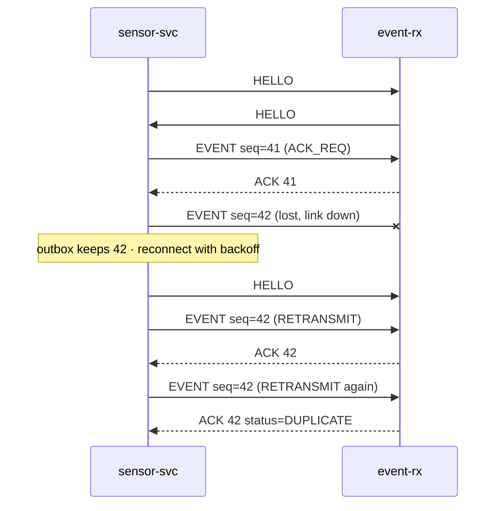

# Protocol v0
Status: Bản nháp — chốt bằng ADR "Framing + integrity" (04/2027), sau lab [struct-union](../../../c-cpp-foundation/struct-union/README.md).
Dùng chung cho mọi kênh: RPMsg (M33 ↔ A35), TCP/TLS và UDP (MP257F ↔ Jetson). Encode/decode bằng shift/mask trên byte buffer; không cast byte buffer sang struct.

## Frame
Mọi trường nhiều byte theo big-endian (network byte order). Header 20 byte + payload + CRC-32 4 byte.

| Offset | Size | Trường | Mô tả |
| --- | --- | --- | --- |
| 0 | 2 | magic | `0x45 0x43` ("EC") |
| 2 | 1 | version | `0` cho bản nháp này |
| 3 | 1 | type | Loại message, xem bảng dưới |
| 4 | 1 | flags | bit 0 `ACK_REQ`, bit 1 `RETRANSMIT`; các bit khác bằng 0 |
| 5 | 1 | reserved | `0` |
| 6 | 4 | seq | uint32 tăng dần theo từng frame của bên gửi; về 0 khi service khởi động lại |
| 10 | 8 | timestamp_ns | uint64, CLOCK_REALTIME (ns từ Unix epoch) lúc tạo frame |
| 18 | 2 | payload_len | uint16, tối đa 4096 |
| 20 | N | payload | Theo loại message |
| 20 + N | 4 | crc32 | CRC-32/ISO-HDLC (như zlib) trên byte `[0, 20 + N)` |

Kênh RPMsg giới hạn 496 byte payload mỗi message: một message RPMsg chứa đúng một frame, nên frame qua RPMsg ≤ 496 byte (IMU_BATCH 10 mẫu = 158 byte).

## Message
| Type | Tên | Chiều | Payload |
| --- | --- | --- | --- |
| `0x01` | HELLO | Cả hai, frame đầu tiên của kết nối | device_id 16 byte ASCII (đệm `0x00`), fw_version 16 byte, accel_ug_per_lsb uint32, gyro_udps_per_lsb uint32, odr_mhz uint32 |
| `0x02` | HEARTBEAT | Cả hai, mỗi 1 s | uptime_s, frames_tx, frames_rx, crc_errors, reconnects, events_dropped — mỗi trường uint32 |
| `0x10` | IMU_BATCH | MP257F → Jetson | first_sample_ns uint64, sample_period_ns uint32, count uint16, rồi count × (ax, ay, az, gx, gy, gz) int16 |
| `0x20` | EVENT | MP257F → Jetson, luôn có `ACK_REQ` | event_id 16 byte (UUID ngẫu nhiên), kind uint8 (1 FALL, 2 SHOCK, 3 MANUAL), reserved uint8, t_event_ns uint64, peak_mg uint16, duration_ms uint16 |
| `0x30` | DETECTION | Jetson → MP257F | class_id uint16, confidence_permille uint16, t_frame_ns uint64 |
| `0x31` | LED_CMD | Jetson → MP257F | pattern uint8 (0 off, 1 on, 2 blink), duration_ms uint16, buzzer uint8 (0/1) |
| `0x7F` | ACK | Cả hai | acked_seq uint32, status uint8 (0 OK, 1 REJECTED, 2 DUPLICATE) |

Giá trị HELLO cho cấu hình thiết kế: accel ±16 g → 488 µg/LSB; gyro ±2000 dps → 70000 µdps/LSB; ODR 104 Hz → 104000 mHz.

## Quy tắc
- **Validate theo thứ tự:** magic → version → payload_len ≤ 4096 → đủ byte → CRC. Lỗi ở bất kỳ bước nào: tăng counter tương ứng; TCP thì đóng kết nối và để bên gửi kết nối lại, UDP thì bỏ datagram.
- **Message lạ:** type chưa biết thì bỏ qua và tăng counter, để phiên bản sau thêm message mà không làm hỏng bên nhận cũ. Version lạ thì từ chối kết nối và ghi log.
- **ACK và gửi lại:** EVENT nằm trong outbox của bên gửi tới khi nhận ACK. Chưa có ACK sau 500 ms thì gửi lại với cờ `RETRANSMIT`; sau khi kết nối lại thì gửi lại toàn bộ outbox theo thứ tự.
- **Chống trùng:** bên nhận nhớ 1024 event_id gần nhất; event_id đã thấy thì vẫn ACK với status `DUPLICATE` nhưng không trigger lại.
- **Mất gói:** với IMU_BATCH, khoảng trống trong seq là số batch bị mất; dùng để tính tỉ lệ mất gói (R04).
- **Thời gian:** timestamp_ns và t_event_ns dùng CLOCK_REALTIME đã đồng bộ chrony; mọi timeout trong code dùng CLOCK_MONOTONIC.

## Ánh xạ transport
| Transport | Cách đóng gói | Ghi chú |
| --- | --- | --- |
| TCP 5000 | Luồng frame nối tiếp | TLS từ 04/2027; một kết nối mỗi thiết bị |
| UDP 5001 | Một frame mỗi datagram | Chỉ IMU_BATCH, không gửi lại; dùng để đo mất gói |
| RPMsg | Một frame mỗi message | ≤ 496 byte |
| MQTT (nếu ADR chọn) | Cả frame là payload nhị phân | `edgecap/<device_id>/imu` QoS 0, `edgecap/<device_id>/event` QoS 1 |

## ACK và gửi lại

## Test vectors
Sinh bằng Python `zlib.crc32` và `struct`; dùng làm unit test đầu tiên cho codec C.

| Vector | Giá trị |
| --- | --- |
| CRC-32 của ASCII `123456789` | `0xCBF43926` |
| ACK: seq 7, timestamp_ns 1794020400000000000 (2026-11-07T03:00:00Z), acked_seq 42, status 0 | `45 43 00 7F 00 00 00 00 00 07 18 E5 A4 0C 75 CD E0 00 00 05` `00 00 00 2A 00` `69 B6 B4 25` |
| Cùng frame ACK, đổi 1 bit bất kỳ | Phải bị từ chối vì sai CRC |
| Cùng frame ACK, cắt còn 28 byte | Phải chờ thêm dữ liệu (TCP) hoặc bị từ chối (UDP) |
| Cùng frame ACK, byte 0 = `0x00` | Phải bị từ chối vì sai magic |
