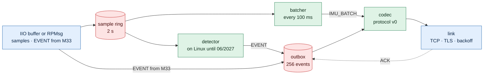
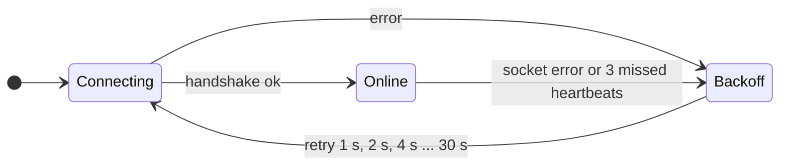
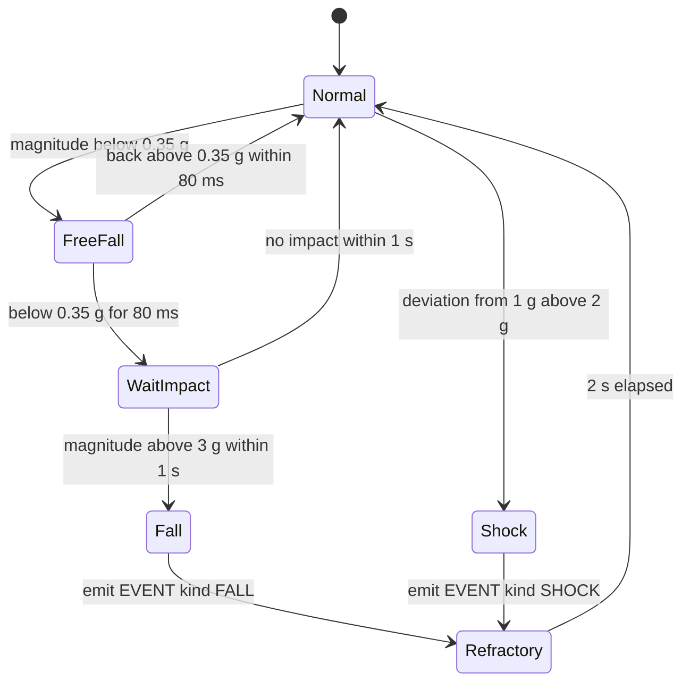
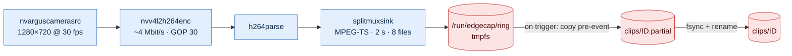

# Software design
Status: Bản nháp, chưa có code. Các con số là giá trị khởi đầu, chỉnh theo phép đo và ghi lý do vào ADR.

## Nguyên tắc chung
- C11 cho sensor-svc và protocol; C++17 cho recorder; event-rx C++ hoặc Go theo ADR. Code chung phải build được bằng GCC 7 (JetPack 4.6).
- Không cấp phát động trong vòng lặp lấy mẫu và đường gửi dữ liệu; buffer kích thước cố định, tạo lúc khởi động.
- Lỗi I/O tạm thời được log kèm errno và counter; service không thoát vì lỗi có thể phục hồi.
- CLOCK_MONOTONIC cho timeout và khoảng thời gian; CLOCK_REALTIME (đã đồng bộ chrony) cho timestamp trong frame và metadata.
- Cấu hình bằng file INI trong `/etc/edgecap/`; không hard-code địa chỉ hay ngưỡng.
- Mỗi service một user riêng, chạy dưới systemd có watchdog và sandboxing.

## sensor-svc (MP257F, Cortex-A35)
Một luồng, vòng lặp `epoll`: không cần khóa, dễ suy luận về thứ tự sự kiện.



| File descriptor trong epoll | Việc |
| --- | --- |
| IIO buffer hoặc `/dev/rpmsg0` | Đọc mẫu vào sample ring; nhận EVENT và gửi LED_CMD xuống M33 |
| Socket TCP/TLS | Gửi frame, nhận ACK, DETECTION, LED_CMD |
| timerfd 100 ms | Đóng gói IMU_BATCH từ các mẫu mới |
| timerfd 1 s | HEARTBEAT kèm counter; `sd_notify("WATCHDOG=1")` khi vòng lặp còn khỏe |
| timerfd 500 ms | Gửi lại event chưa có ACK |
| signalfd | SIGTERM: gửi nốt outbox trong 2 s rồi thoát; SIGHUP: đọc lại cấu hình |

Đường IIO (12/2026–06/2027): bật kênh trong `scan_elements`, đặt `buffer/length`, chọn trigger data-ready, `buffer/enable = 1`, rồi đọc mẫu từ `/dev/iio:deviceN`.

Outbox:
- Tối đa 256 event, giữ đến khi nhận ACK; đầy thì bỏ event cũ nhất và tăng `events_dropped` (R03).
- IMU_BATCH không vào outbox: khi mất link thì bỏ và tăng `batches_dropped`.
- Outbox nằm trong RAM; mất điện MP257F thì mất event chưa ACK. Ghi outbox xuống flash (write-ahead + fsync) là phương án sau, đổi lại độ mòn flash — quyết định bằng ADR nếu cần.

## State machines
### Link (sensor-svc)


### Detector


| Tham số | Khóa cấu hình | Giá trị khởi đầu |
| --- | --- | --- |
| Ngưỡng rơi tự do | `freefall_g` | 0.35 g |
| Thời gian rơi tối thiểu | `freefall_ms` | 80 ms (≈ 9 mẫu ở 104 Hz) |
| Ngưỡng va đập sau rơi | `impact_g` | 3.0 g |
| Cửa sổ chờ va đập | `impact_window_ms` | 1000 ms |
| Ngưỡng sốc (lệch khỏi 1 g) | `shock_g` | 2.0 g |
| Khoảng nghỉ giữa hai event | `refractory_ms` | 2000 ms |

Hiệu chỉnh ngưỡng:
- Ghi dataset thật, mỗi loại ≥ 20 lần: đi bộ cầm cảm biến, lắc, gõ, đặt mạnh xuống bàn, và rơi có kiểm soát. Khi thử rơi, chỉ thả cảm biến gắn trên khối xốp xuống đệm, không thả board.
- Tính số event đúng, báo nhầm và bỏ sót cho từng bộ ngưỡng; chọn ngưỡng bằng số liệu.
- Lưu CSV vào `evidence/` và dùng làm replay test trong CI.

Phương án thay thế (ADR "Nơi phát hiện sự kiện"): dùng chức năng free-fall và wake-up có sẵn của LSM6DSOX để kéo INT1, CPU chỉ xác nhận lại.

## imu-fw (Cortex-M33, 06/2027)
- STM32CubeMP2; I2C hoặc SPI và GPIO của cảm biến được gán cho M33 (cấu hình qua device tree/RIF theo wiki ST); INT1 nối EXTI.
- Mỗi ngắt INT1: đọc liền 12 byte từ thanh ghi gyro + accel, đẩy vào ring trên M33, chạy detector.
- Mỗi 100 ms gửi IMU_BATCH qua RPMsg; EVENT gửi ngay; nhận LED_CMD để điều khiển LED/buzzer.
- Timestamp: M33 không có giờ thực. Phương án: M33 gắn tick timer 1 MHz; sensor-svc ánh xạ tick sang CLOCK_REALTIME bằng các cặp (tick, thời điểm nhận) và hồi quy tuyến tính — câu hỏi mở, đo jitter để chốt (R13).
- Linux nạp và khởi động firmware qua remoteproc (`/sys/class/remoteproc/remoteproc0`).

## event-rx (Jetson)
- Lắng nghe TCP 5000 (TLS từ 04/2027), mỗi thiết bị một kết nối; kiểm tra HELLO và certificate.
- Validate frame theo [protocol](protocol.md#quy-tắc); chống trùng bằng 1024 event_id gần nhất; trả ACK.
- Giữ ring IMU 60 s để ghi `imu.csv` cho clip; forward luồng IMU về host.
- Khi nhận EVENT: bật GPIO marker (đo R07), gửi trigger cho recorder qua Unix socket `/run/edgecap/recorder.sock` dạng JSON line: `{"event_id": "…", "t_event_ns": 0, "kind": "FALL"}`.

## recorder (Jetson)


Phác thảo pipeline, chưa chạy — kiểm tra tên element và property bằng `gst-inspect-1.0` trên JetPack 4.6 (GStreamer 1.14):
```bash
gst-launch-1.0 -e nvarguscamerasrc sensor-id=0 \
  ! 'video/x-raw(memory:NVMM),width=1280,height=720,framerate=30/1' \
  ! nvv4l2h264enc bitrate=4000000 iframeinterval=30 insert-sps-pps=true \
  ! h264parse \
  ! splitmuxsink muxer=mpegtsmux max-size-time=2000000000 max-files=8 \
      location=/run/edgecap/ring/seg_%05d.ts
```

Ghi clip:
1. Theo dõi segment đã đóng bằng inotify (`IN_CLOSE_WRITE`) trên thư mục ring; ghi thời điểm đóng theo CLOCK_REALTIME.
2. Khi có trigger tại `t_event`: tạo `clips/<id>.partial/`, copy các segment phủ khoảng `[t_event − 10 s, hiện tại]` (ring 16 s chừa một segment dự phòng cho sai số biên).
3. Tiếp tục copy segment mới cho tới khi phủ `t_event + 20 s`; trigger lặp lại thì kéo dài, tối đa 60 s mỗi clip.
4. Ghi `imu.csv` (từ event-rx) và `meta.json`; tính `SHA256SUMS`.
5. `fsync` từng file và thư mục, rồi `rename` `.partial` thành tên cuối: rename là nguyên tử nên clip luôn ở trạng thái đủ hoặc chưa tồn tại.
6. Khi khởi động: thư mục `.partial` còn sót do mất điện được đánh dấu và báo trong log, không bị coi là clip hợp lệ (R11).

MPEG-TS được chọn vì segment đã đóng phát được ngay, không phụ thuộc chỉ mục cuối file như MP4 thường. Nếu đổi sang fragmented MP4, ghi lý do vào ADR "Pre-event buffer".

Retention (R15): kiểm tra dung lượng mỗi phút; vượt 85% thì xóa clip cũ nhất đã được host nhận; không xóa clip chưa được nhận, chỉ cảnh báo.

### meta.json
Ví dụ minh họa schema, không phải dữ liệu thật:
```json
{
  "schema": 1,
  "event_id": "3f2c9a1e-7b4d-4e8a-9c1f-5d6b2a0e8f41",
  "device_id": "dev-5c1e9a07",
  "kind": "FALL",
  "t_event_utc": "2027-05-20T08:15:42.123456789Z",
  "clock_offset_ms": 0.8,
  "pre_event_s": 10,
  "post_event_s": 20,
  "video": {"codec": "h264", "width": 1280, "height": 720, "fps": 30, "segments": ["seg_00041.ts", "seg_00042.ts"]},
  "imu": {"file": "imu.csv", "odr_hz": 104, "accel_fs_g": 16, "gyro_fs_dps": 2000},
  "software": {"sensor_svc": "0.1.0", "event_rx": "0.1.0", "recorder": "0.1.0"}
}
```

## Lưu trữ trên Jetson
```text
/run/edgecap/
├── ring/                      # tmpfs, 8 segment × 2 s
└── recorder.sock              # trigger từ event-rx
/var/lib/edgecap/
├── clips/
│   ├── 20270520T081542Z_3f2c9a1e/
│   │   ├── seg_00041.ts ... seg_00056.ts
│   │   ├── imu.csv
│   │   ├── meta.json
│   │   └── SHA256SUMS
│   └── 20270520T090102Z_7a1b4c2d.partial/   # đang ghi hoặc bị cắt ngang khi mất điện
└── state/                     # counter, trạng thái đã gửi lên host
/etc/edgecap/                  # *.conf; certificate và key (quyền 0600)
```

## systemd
Ví dụ cho sensor-svc; các service khác theo cùng mẫu:
```ini
[Unit]
Description=Edge capture sensor service
After=network-online.target time-sync.target
Wants=network-online.target

[Service]
Type=notify
ExecStart=/usr/bin/sensor-svc --config /etc/edgecap/sensor-svc.conf
Restart=on-failure
RestartSec=1
WatchdogSec=5
User=edgecap
Group=edgecap
NoNewPrivileges=yes
ProtectSystem=strict
ProtectHome=yes
PrivateTmp=yes
ReadWritePaths=/var/lib/edgecap

[Install]
WantedBy=multi-user.target
```
Quyền truy cập `/dev/iio:device*` và `/dev/rpmsg*` cấp qua udev rule cho group `edgecap`, không chạy service bằng root.

## Cấu hình
```ini
[sensor]
source = iio
iio_device = iio:device0
odr_hz = 104

[detector]
freefall_g = 0.35
freefall_ms = 80
impact_g = 3.0
impact_window_ms = 1000
shock_g = 2.0
refractory_ms = 2000

[link]
server = 192.168.50.20:5000
tls = true
ca_file = /etc/edgecap/ca.pem
cert_file = /etc/edgecap/device.pem
key_file = /etc/edgecap/device.key
outbox_events = 256
heartbeat_ms = 1000
resend_ms = 500
```

## Observability
| Service | Counter |
| --- | --- |
| sensor-svc | samples_read, io_errors, batches_sent, batches_dropped, events_detected, events_sent, events_acked, events_dropped, reconnects, tls_errors |
| event-rx | frames_rx, crc_errors, bad_magic, unknown_type, duplicates, acks_sent, events_forwarded |
| recorder | segments_closed, clips_written, clips_partial_found, write_errors, retention_deleted, pipeline_restarts |

- Log có cấu trúc dạng `key=value` qua journald; một dòng cho mỗi event, mang event_id để lần theo xuyên hai board.
- Counter đi kèm HEARTBEAT (R16) và được host ghi lại theo thời gian.
- Log và metadata không chứa MAC, serial hay dữ liệu định danh; device ID là chuỗi ngẫu nhiên tạo khi provisioning (R17).

## Bảo mật (tới 07/2027)
- mTLS với certificate cấp từ CA riêng của lab (openssl); key quyền 0600, sau này chuyển vào OP-TEE.
- `SHA256SUMS` cho mỗi clip ngay từ 05/2027; ký clip (ví dụ Ed25519) và threat model STRIDE ở 07/2027.
- Sandboxing systemd như mẫu ở trên; chỉ mở các cổng trong [mạng lab](hardware.md#mạng-lab).

## Triển khai
| Giai đoạn | MP257F | Jetson |
| --- | --- | --- |
| 12/2026–02/2027 | Cross compile bằng SDK, `scp`, `systemctl restart` | — |
| Từ 03/2027 | Recipe trong `yocto/meta-edgecap` (`inherit systemd`), có sẵn trong image | — |
| 04–06/2027 | Như trên | Build native trên Jetson (glibc 2.27), cài bằng script hoặc package |
| Từ 06/2027 | OTA A/B (RAUC hoặc SWUpdate) cho image MP257F | Cập nhật bằng package; OTA cho Jetson ngoài scope |
