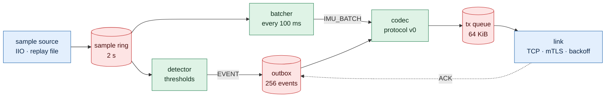
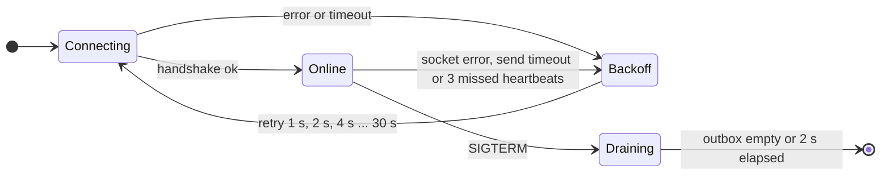
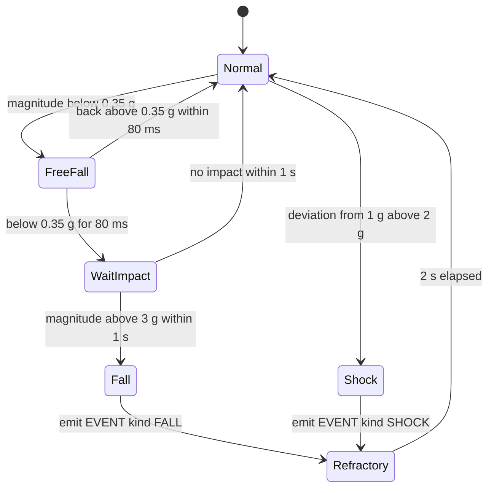
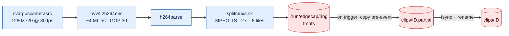

# Software design
Status: Bản nháp, chưa có code. Các con số là giá trị khởi đầu, chỉnh theo phép đo và ghi lý do vào ADR.

## Nguyên tắc chung
- C11 cho sensor-svc, protocol và rx-host; C++17 cho edge-svc — service C++ duy nhất của project. Không thêm ngôn ngữ khác; Python chỉ dùng cho script test và đo. Code chạy trên Jetson phải build được bằng GCC 7 (JetPack 4.6).
- Không cấp phát động trong vòng lặp lấy mẫu và đường gửi dữ liệu; buffer kích thước cố định, tạo lúc khởi động.
- Lỗi I/O tạm thời được log kèm errno và counter; service không thoát vì lỗi có thể phục hồi.
- Socket non-blocking; mọi chỗ chờ đều có timeout. CLOCK_MONOTONIC cho timeout và khoảng thời gian; CLOCK_REALTIME (đã đồng bộ chrony) cho timestamp trong frame và metadata.
- Cấu hình bằng file INI trong `/etc/edgecap/`; không hard-code địa chỉ, ngưỡng hay số thứ tự IIO device.
- Bảo mật xét từ thiết kế: mỗi service một user riêng, không chạy bằng root, chạy dưới systemd có watchdog và sandboxing; giả định và biện pháp ghi trong [threat model](threat-model.md).

## sensor-svc (MP257F, Cortex-A35)
Một luồng, vòng lặp `epoll`: không cần khóa, dễ suy luận về thứ tự sự kiện.



| File descriptor trong epoll | Việc |
| --- | --- |
| IIO buffer (một hoặc hai fd) | Đọc mẫu vào sample ring |
| Socket TCP (mTLS từ 04/2027) | Gửi phần còn lại của tx queue khi có `EPOLLOUT`; nhận ACK và HEARTBEAT |
| timerfd 100 ms | Đóng gói IMU_BATCH từ các mẫu mới |
| timerfd 1 s | HEARTBEAT kèm counter; kiểm tra timeout gửi; `sd_notify("WATCHDOG=1")` khi vòng lặp còn khỏe |
| timerfd 500 ms | Gửi lại event chưa có ACK |
| signalfd | SIGTERM: ngừng đọc mẫu, gửi nốt outbox trong tối đa 2 s, đóng socket, thoát (R21); SIGHUP: đọc lại cấu hình |

### Nguồn mẫu
Nguồn mẫu là một ops table chọn lúc chạy (bài Deep dive của [function pointer](../../../c-cpp-foundation/function-pointer/README.md)): `iio` cho board, `replay` đọc CSV đã ghi để test trên host và trong CI. Phần mở rộng M33 chỉ thêm nguồn `rpmsg`; phần còn lại của service không đổi.

| Giai đoạn | Driver | Cách đọc |
| --- | --- | --- |
| 12/2026–01/2027 | `st_lsm6dsx` có sẵn | Hai IIO device (accel, gyro), mẫu đến theo lô FIFO watermark; đặt `sampling_frequency`, bật kênh trong `scan_elements`, đặt `buffer/watermark` và `buffer/enable`; ghép mẫu hai device theo timestamp |
| Từ 02/2027 | Driver IIO tự viết | Một device sáu kênh + timestamp; trigger data-ready (`trigger/current_trigger`), một mẫu mỗi ngắt |

Chọn device theo thuộc tính `name` trong `/sys/bus/iio/devices/*/name`, không theo số thứ tự `iio:deviceN` vì số này đổi theo thứ tự probe. Tên thuộc tính sysfs kiểm lại trên kernel đang chạy và ghi vào REPORT của lab [IIO subsystem](../../../linux-kernel/iio-subsystem/README.md).

### Partial I/O và backpressure
Đây là phần skeleton 12/2026 phải làm đúng trước mọi tính năng khác (R03, R20).
- **Gửi:** frame đã encode vào tx queue cố định 64 KiB. `send()` trả về ít hơn độ dài hoặc `EAGAIN` thì giữ offset, bật `EPOLLOUT`, gửi tiếp khi socket ghi được. Không bao giờ chặn vòng lặp để chờ socket.
- **Queue đầy:** bỏ IMU_BATCH mới và tăng `batches_dropped`; EVENT không bị bỏ ở đây vì vẫn nằm trong outbox chờ ACK.
- **Timeout gửi:** tx queue không giảm trong 5 s (receiver ngừng đọc) thì đóng kết nối, tăng `send_timeouts`, chuyển link sang Backoff.
- **Nhận:** byte nhận được nối vào rx buffer; decode lặp lại chừng nào còn một frame đủ byte; phần dư giữ cho lần đọc sau. Frame lỗi theo [quy tắc](protocol.md#quy-tắc) thì đóng kết nối.
- **Kiểm chứng:** unit test cắt frame ở mọi vị trí; rx-host ở chế độ đọc từng byte, đọc chậm, ngừng đọc; sensor-svc chạy với `SO_SNDBUF` nhỏ để partial write xảy ra thường xuyên.

### Outbox
- Tối đa 256 event, giữ đến khi nhận ACK; đầy thì bỏ event cũ nhất và tăng `events_dropped` (R03).
- IMU_BATCH không vào outbox: khi mất link thì bỏ và tăng `batches_dropped`.
- Outbox nằm trong RAM; mất điện MP257F thì mất event chưa ACK. Nếu sau này outbox ghi xuống flash (write-ahead + fsync), bước đó phải có ngay test đầy ổ đĩa và cắt nguồn (R11, R15) — quyết định bằng ADR.

## State machines
### Link (sensor-svc)


### Detector (sensor-svc)


| Tham số | Khóa cấu hình | Giá trị khởi đầu |
| --- | --- | --- |
| Ngưỡng rơi tự do | `freefall_g` | 0.35 g |
| Thời gian rơi tối thiểu | `freefall_ms` | 80 ms (≈ 9 mẫu ở 104 Hz) |
| Ngưỡng va đập sau rơi | `impact_g` | 3.0 g |
| Cửa sổ chờ va đập | `impact_window_ms` | 1000 ms |
| Ngưỡng sốc (lệch khỏi 1 g) | `shock_g` | 2.0 g |
| Khoảng nghỉ giữa hai event | `refractory_ms` | 2000 ms |

Hiệu chỉnh ngưỡng:
- Ghi dataset thật, mỗi loại ≥ 20 lần: đi bộ cầm cảm biến, lắc, gõ, đặt mạnh xuống bàn, và rơi có kiểm soát. Khi thử rơi, chỉ thả cảm biến gắn trên khối xốp xuống đệm, không thả board.
- Tính số event đúng, báo nhầm và bỏ sót cho từng bộ ngưỡng; chọn ngưỡng bằng số liệu.
- Lưu CSV vào `evidence/` và dùng làm replay test trong CI (nguồn mẫu `replay`).

Phương án thay thế (ADR "Nơi phát hiện sự kiện"): dùng chức năng free-fall và wake-up có sẵn của LSM6DSOX để kéo ngắt, CPU chỉ xác nhận lại.

## rx-host (laptop)
Receiver của skeleton từ 12/2026, viết bằng C và dùng chung thư viện protocol. Khi edge-svc thay nó ở 04/2027, rx-host ở lại làm receiver kiểm thử có chế độ lỗi:

| Chế độ | Mô phỏng | Requirement |
| --- | --- | --- |
| `--byte-by-byte` | TCP chia frame tùy ý | R20 |
| `--slow <bytes/s>` | Receiver chậm, tx queue của sensor-svc đầy dần | R03 |
| `--stop-reading <s>` | Receiver treo nhưng không đóng kết nối | R03 |
| `--close-mid-frame` | Mất kết nối giữa chừng một frame | R03, R20 |
| `--no-ack` | Không trả ACK, outbox đầy dần | R03 |
| `--send-garbage` | Receiver gửi frame rác ngược về sensor-svc | R02, R16 |

rx-host ghi mẫu nhận được ra CSV và in counter khi thoát; script đo của R04 đọc file này.

## edge-svc (Jetson, C++17)
Một process gồm ba module, giao tiếp qua hàng đợi trong process:

| Module | Việc |
| --- | --- |
| receiver | Lắng nghe TCP 5000 (mTLS), mỗi thiết bị một kết nối; kiểm tra HELLO và certificate; validate frame theo [quy tắc](protocol.md#quy-tắc); chống trùng bằng 1024 event_id gần nhất; trả ACK; giữ ring IMU 60 s; khi nhận EVENT thì bật GPIO marker (đo R07) và đẩy trigger cho recorder |
| storage | Ghi luồng IMU ra file theo giờ (`.partial` → fsync → rename); retention khi storage vượt 85% (R15); đánh dấu dữ liệu đã được host nhận |
| recorder | Pipeline GStreamer, ring segment, ghi clip, metadata, SHA-256 |

- Dùng lại kết quả của lab [Modern C++ cho embedded](../../../c-cpp-foundation/cpp-modern-embedded/README.md): `UniqueFd` cho mọi fd, `RingBuffer<T, N>` cho ring IMU, RAII cho object GStreamer và OpenSSL; gọi thư viện C qua biên `extern "C"` theo lab [interop](../../../c-cpp-foundation/cpp-c-interop/README.md).
- Unit test bằng GoogleTest, chạy trên host và trong CI; module receiver và storage test được trên laptop trước khi có Jetson.
- Storage bắt đầu ghi ở 04/2027, nên test đầy ổ đĩa (R15) và cắt nguồn (R11, 100 lần) chạy ngay trong milestone đó, trước khi có camera.
- Tách recorder thành process con để lỗi pipeline không kéo theo receiver là một lựa chọn trong [open decisions](../README.md#open-decisions).

### Recorder


Phác thảo pipeline, chưa chạy — kiểm tra tên element và property bằng `gst-inspect-1.0` trên JetPack 4.6 (GStreamer 1.14):
```bash
gst-launch-1.0 -e nvarguscamerasrc sensor-id=0 \
  ! 'video/x-raw(memory:NVMM),width=1280,height=720,framerate=30/1' \
  ! nvv4l2h264enc bitrate=4000000 iframeinterval=30 insert-sps-pps=true \
  ! h264parse \
  ! splitmuxsink muxer=mpegtsmux max-size-time=2000000000 max-files=8 \
      location=/run/edgecap/ring/seg_%05d.ts
```

Ghi clip:
1. Theo dõi segment đã đóng bằng inotify (`IN_CLOSE_WRITE`) trên thư mục ring; ghi thời điểm đóng theo CLOCK_REALTIME.
2. Khi có trigger tại `t_event`: tạo `clips/<id>.partial/`, copy các segment phủ khoảng `[t_event − 10 s, hiện tại]` (ring 16 s chừa một segment dự phòng cho sai số biên).
3. Tiếp tục copy segment mới cho tới khi phủ `t_event + 20 s`; trigger lặp lại thì kéo dài, tối đa 60 s mỗi clip.
4. Ghi `imu.csv` (từ ring IMU của receiver) và `meta.json`; tính `SHA256SUMS`.
5. `fsync` từng file và thư mục, rồi `rename` `.partial` thành tên cuối: rename là nguyên tử nên clip luôn ở trạng thái đủ hoặc chưa tồn tại.
6. Khi khởi động: thư mục `.partial` còn sót do mất điện được đánh dấu và báo trong log, không bị coi là clip hợp lệ (R11).

MPEG-TS được chọn vì segment đã đóng phát được ngay, không phụ thuộc chỉ mục cuối file như MP4 thường. Nếu đổi sang fragmented MP4, ghi lý do vào ADR "Pre-event buffer".

Retention (R15): kiểm tra dung lượng mỗi phút; vượt 85% thì xóa clip cũ nhất đã được host nhận; không xóa clip chưa được nhận, chỉ cảnh báo. Ghi thất bại vì `ENOSPC` thì clip đang ghi giữ ở `.partial`, recorder chuyển sang Degraded, receiver vẫn chạy.

### meta.json
Ví dụ minh họa schema, không phải dữ liệu thật:
```json
{
  "schema": 1,
  "event_id": "3f2c9a1e-7b4d-4e8a-9c1f-5d6b2a0e8f41",
  "device_id": "dev-5c1e9a07",
  "kind": "FALL",
  "t_event_utc": "2027-05-20T08:15:42.123456789Z",
  "clock_offset_ms": 0.8,
  "pre_event_s": 10,
  "post_event_s": 20,
  "video": {"codec": "h264", "width": 1280, "height": 720, "fps": 30, "segments": ["seg_00041.ts", "seg_00042.ts"]},
  "imu": {"file": "imu.csv", "odr_hz": 104, "accel_fs_g": 16, "gyro_fs_dps": 2000},
  "software": {"sensor_svc": "0.1.0", "edge_svc": "0.1.0"}
}
```

## imu-fw (Cortex-M33, mở rộng 08/2027)
Chỉ bắt đầu sau khi Cổng 2 đạt; đường IIO vẫn là đường chính.
- STM32CubeMP2; I2C và GPIO của cảm biến được gán cho M33 (cấu hình qua device tree/RIF theo wiki ST); INT1 nối EXTI.
- Mỗi ngắt INT1: đọc liền 12 byte từ thanh ghi gyro + accel, đẩy vào ring trên M33.
- Mỗi 100 ms gửi IMU_BATCH qua RPMsg; sensor-svc nhận qua nguồn mẫu `rpmsg`, detector vẫn chạy trên Linux.
- Timestamp: M33 không có giờ thực. Phương án: M33 gắn tick timer 1 MHz; sensor-svc ánh xạ tick sang CLOCK_REALTIME bằng các cặp (tick, thời điểm nhận) và hồi quy tuyến tính — câu hỏi mở, đo jitter để chốt (R13).
- Linux nạp và khởi động firmware qua remoteproc (`/sys/class/remoteproc/remoteproc0`).

## Lưu trữ trên Jetson
```text
/run/edgecap/
└── ring/                      # tmpfs, 8 segment × 2 s
/var/lib/edgecap/
├── imu/
│   ├── 20270520T08.csv        # luồng IMU theo giờ
│   └── 20270520T09.csv.partial
├── clips/
│   ├── 20270520T081542Z_3f2c9a1e/
│   │   ├── seg_00041.ts ... seg_00056.ts
│   │   ├── imu.csv
│   │   ├── meta.json
│   │   └── SHA256SUMS
│   └── 20270520T090102Z_7a1b4c2d.partial/   # đang ghi hoặc bị cắt ngang khi mất điện
└── state/                     # counter, trạng thái đã gửi lên host
/etc/edgecap/                  # *.conf; certificate và key (chủ sở hữu là user của service, quyền 0600)
```

## systemd
Ví dụ cho sensor-svc; edge-svc theo cùng mẫu với user `edge-svc`:
```ini
[Unit]
Description=Edge capture sensor service
After=network-online.target time-sync.target
Wants=network-online.target

[Service]
Type=notify
# Bật kênh IIO cần ghi sysfs: bước này chạy với quyền đầy đủ, service chính thì không
ExecStartPre=+/usr/libexec/edgecap/iio-setup --config /etc/edgecap/sensor-svc.conf
ExecStart=/usr/bin/sensor-svc --config /etc/edgecap/sensor-svc.conf
Restart=on-failure
RestartSec=1
WatchdogSec=5
TimeoutStopSec=3
User=sensor-svc
Group=edgecap
NoNewPrivileges=yes
CapabilityBoundingSet=
ProtectSystem=strict
ProtectHome=yes
PrivateTmp=yes
ProtectKernelTunables=yes
ProtectKernelModules=yes
ProtectControlGroups=yes
DevicePolicy=closed
DeviceAllow=char-iio r
RestrictAddressFamilies=AF_INET AF_UNIX
ReadWritePaths=/var/lib/edgecap

[Install]
WantedBy=multi-user.target
```
- `/dev/iio:device*` cấp quyền đọc cho group `edgecap` bằng udev rule; ở skeleton v0 (chưa có systemd) sensor-svc chạy bằng user thường thuộc group này, phần bật kênh chạy một lần bằng `sudo iio-setup`.
- Điểm `systemd-analyze security sensor-svc` ghi vào evidence ở mỗi milestone (R18); option nào không dùng được trên phiên bản systemd của image thì ghi lý do.
- `/dev/rpmsg*` chỉ được thêm vào `DeviceAllow` khi làm phần mở rộng M33.

## Cấu hình
```ini
[sensor]
source = iio
# st_lsm6dsx (12/2026–01/2027): hai device; driver tự viết: một device
iio_names = lsm6dsox_accel, lsm6dsox_gyro
odr_hz = 104

[detector]
freefall_g = 0.35
freefall_ms = 80
impact_g = 3.0
impact_window_ms = 1000
shock_g = 2.0
refractory_ms = 2000

[link]
# rx-host trên laptop tới 03/2027; edge-svc trên Jetson từ 04/2027
server = 192.168.50.20:5000
tls = true
ca_file = /etc/edgecap/ca.pem
cert_file = /etc/edgecap/device.pem
key_file = /etc/edgecap/device.key
outbox_events = 256
tx_queue_bytes = 65536
send_timeout_ms = 5000
heartbeat_ms = 1000
resend_ms = 500
```
Tên IIO device ở trên là dự kiến; kiểm lại bằng `cat /sys/bus/iio/devices/*/name` trên board.

## Observability
| Service | Counter |
| --- | --- |
| sensor-svc | samples_read, io_errors, batches_sent, batches_dropped, partial_writes, send_timeouts, events_detected, events_sent, events_acked, events_dropped, reconnects, tls_errors |
| rx-host | frames_rx, crc_errors, bad_magic, seq_gaps, bytes_rx |
| edge-svc | frames_rx, crc_errors, bad_magic, unknown_type, duplicates, acks_sent, imu_files_written, storage_full, segments_closed, clips_written, clips_partial_found, write_errors, retention_deleted, pipeline_restarts |

- Log có cấu trúc dạng `key=value` qua journald; một dòng cho mỗi event, mang event_id để lần theo xuyên hai board.
- Counter đi kèm HEARTBEAT (R16) và được host ghi lại theo thời gian; script đo của R04 đọc counter này.
- Log và metadata không chứa MAC, serial hay dữ liệu định danh; device ID là chuỗi ngẫu nhiên tạo khi provisioning (R17).

## Bảo mật
Xét từ thiết kế, cập nhật theo [threat model](threat-model.md) ở mỗi milestone:
- 12/2026: không service nào chạy bằng root (R18); chỉ mở các cổng trong [mạng lab](hardware.md#mạng-lab); decoder chịu được input bất kỳ (R02, fuzz từ 01/2027).
- 01/2027: user riêng + sandboxing systemd như mẫu ở trên.
- 04/2027: mTLS với certificate cấp từ CA riêng của lab (openssl); key quyền 0600 thuộc user của service.
- 05/2027: `SHA256SUMS` cho mỗi clip.
- Mở rộng 07/2027: image OTA được ký và kiểm chữ ký ngay trong milestone OTA; secure boot, dm-verity; key chuyển vào OP-TEE; ký clip (ví dụ Ed25519).

## Triển khai
| Giai đoạn | MP257F | Jetson |
| --- | --- | --- |
| 12/2026–02/2027 | Cross compile bằng SDK, `scp`, chạy tay (12/2026) rồi `systemctl restart` (từ 01/2027) | — (rx-host chạy trên laptop) |
| 03–06/2027 | Recipe trong `yocto/meta-edgecap` (`inherit systemd`), có sẵn trong image | Từ 04/2027: build native trên Jetson (glibc 2.27), cài bằng script hoặc package |
| Mở rộng 07/2027 | OTA A/B (RAUC hoặc SWUpdate) với image được ký | Cập nhật bằng package; OTA cho Jetson ngoài scope |
