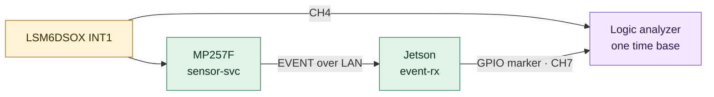

# Test plan
Status: Bản nháp. Mỗi test khi chạy thật ghi kết quả và evidence theo [quy tắc evidence](../README.md#evidence); test nào chưa chạy giữ trạng thái Not run.

## Mức test
| Mức | Chạy ở đâu | Công cụ | Khi nào |
| --- | --- | --- | --- |
| Unit | Host, CI | Unity hoặc CMocka (C), GoogleTest (C++), libFuzzer + sanitizer | Mỗi commit |
| Integration | Hai board + host trên LAN lab | pytest qua SSH/serial, tshark, iperf3, tc netem | Mỗi milestone, trước khi merge thay đổi lớn |
| System | Toàn bộ hệ thống + camera | pytest, logic analyzer, ffprobe | Cuối mỗi mini project |
| Fault injection | Bench | kill, `kill -STOP`, USB relay, fallocate, image lỗi cố ý | Từ 06/2027 |
| Endurance | Bench | Script chạy 24 giờ, thu counter | Trước Cổng 2 |

## Ma trận test
| ID | Mức | Kịch bản | Req | Tiêu chí pass | Chạy | Kết quả |
| --- | --- | --- | --- | --- | --- | --- |
| T-U01 | Unit | Codec round-trip mọi loại message + test vector trong [protocol](protocol.md#test-vectors) | R02 | Khớp từng byte | CI | Not run |
| T-U02 | Unit | Frame lỗi: cắt ngắn, sai magic, sai CRC, version lạ, payload_len quá lớn | R02 | Bị từ chối, counter đúng, không crash | CI | Not run |
| T-U03 | Unit | Fuzz decoder | R02 | 10 phút trong CI và 8 giờ ở local không crash, ASan sạch | CI + local | Not run |
| T-U04 | Unit | Outbox: đầy, ACK, gửi lại theo thứ tự (fake clock) | R03 | Thứ tự đúng, `events_dropped` đúng | CI | Not run |
| T-U05 | Unit | Replay dataset IMU qua detector | R06 | Đúng danh sách event mong đợi; ngưỡng báo nhầm chốt sau khi có dataset | CI | Not run |
| T-I01 | Integration | Rút rồi cắm lại dây cảm biến khi đang chạy | R01 | Có log lỗi, tự phục hồi, service không restart | Bench | Not run |
| T-I02 | Integration | Rút cáp Ethernet trong lúc tạo 5 event, cắm lại | R03 | Đủ 5 event, seq liên tục, không trùng | Bench | Not run |
| T-I03 | Integration | Latency và mất gói TCP/UDP: không tải, có tải iperf3, có `tc netem` loss 1% và delay 20 ms | R04 | Có báo cáo p50/p99 và tỉ lệ mất gói cho từng cấu hình | Bench | Not run |
| T-I04 | Integration | TLS với certificate đúng, sai CA, hết hạn | R05 | Chỉ certificate đúng kết nối được | Bench | Not run |
| T-S01 | System | Gõ/lắc cảm biến 20 lần | R06 | 20 clip đủ 10 s + 20 s, `sha256sum -c` khớp, ffprobe không lỗi | Bench | Not run |
| T-S02 | System | Latency INT1 → event-rx, 100 event | R07 | p99 ≤ 50 ms (budget ban đầu) | Bench | Not run |
| T-S03 | System | Lệch đồng hồ hai board qua sync GPIO | R08 | Có số đo; giá trị khớp với `clock_offset_ms` trong metadata | Bench | Not run |
| T-S04 | System | Detection → LED | R09 | Có số đo latency, ghi vào báo cáo | Bench | Not run |
| T-M01 | System | Jitter lấy mẫu M33 so với Linux | R13 | Có biểu đồ jitter hai phương án | Bench | Not run |
| T-F01 | Fault | `kill -9` và `kill -STOP` từng service | R10 | Chạy lại trong ≤ WatchdogSec + RestartSec; event đã ACK không mất | Bench | Not run |
| T-F02 | Fault | Cắt nguồn Jetson 500 lần khi đang ghi | R11 | 0 clip đã đóng bị hỏng; mọi `.partial` được phát hiện | Bench | Not run |
| T-F03 | Fault | Storage đầy | R15 | Xóa đúng thứ tự, có cảnh báo, không xóa clip chưa gửi | Bench | Not run |
| T-F04 | Fault | Cài bản OTA lỗi cố ý | R12 | Tự rollback về bản trước | Bench | Not run |
| T-F05 | Fault | Gửi frame rác và frame lỗi vào cổng 5000 | R02, R16 | Bị từ chối; counter khớp số frame lỗi đã gửi | Bench | Not run |
| T-E01 | Endurance | Chạy 24 giờ, event ngẫu nhiên mỗi 5 phút | R10, R16 | Memory và số fd không tăng dần; counter khớp | Bench | Not run |
| T-P01 | Privacy | Quét log và metadata của một phiên test | R17 | Không có MAC, serial, IP ngoài LAN lab | CI + bench | Not run |
| T-B01 | Build | Clone sạch, build và chạy unit test | R14 | CI xanh; người khác làm theo README được | CI | Not run |

## Đo latency INT1 → event-rx (T-S02)

1. event-rx bật GPIO marker ngay khi nhận và validate xong một EVENT.
2. Logic analyzer ghi CH4 (INT1) và CH7 (marker) trên cùng một thang thời gian, nên kết quả không phụ thuộc đồng bộ đồng hồ.
3. Tạo ≥ 100 event; ghép mỗi cạnh CH7 với cạnh INT1 của mẫu đã kích hoạt event (theo timestamp mẫu trong log).
4. Báo cáo p50, p95, p99, max; lưu capture `.sr` và script phân tích trong evidence.

## Đo lệch đồng hồ (T-S03)
1. sensor-svc bật sync GPIO mỗi 10 s và ghi `t_mp2` (CLOCK_REALTIME) ngay sau khi bật.
2. Jetson nhận cạnh lên (ngắt GPIO) và ghi `t_jn`.
3. Lệch ≈ `t_jn − t_mp2 − độ trễ ngắt`; độ trễ ngắt đo riêng bằng logic analyzer (CH6 so với marker phía Jetson).
4. So sánh với `chronyc tracking` của hai board và với `clock_offset_ms` trong metadata.

## Test mất điện (T-F02)
1. Host bật relay cấp nguồn Jetson, chờ HEARTBEAT của recorder.
2. Host gửi một EVENT kiểm thử qua cổng test của event-rx (chỉ bật trong build test) để recorder bắt đầu ghi.
3. Cắt nguồn tại thời điểm ngẫu nhiên trong 0–30 s sau trigger.
4. Sau khi boot lại: kiểm tra mọi clip không có hậu tố `.partial` bằng `sha256sum -c` và `ffprobe`; đếm `.partial` được phát hiện.
5. Lặp 500 lần (mỗi vòng khoảng 2 phút, chạy qua đêm); ghi CSV kết quả từng vòng vào evidence.

Rủi ro: rootfs Jetson có thể hỏng sau nhiều lần mất điện; chuẩn bị thẻ dự phòng và ghi riêng số lần hỏng rootfs như một kết quả.

## Fault injection khác
| Lỗi | Cách tiêm |
| --- | --- |
| Mạng chậm, mất gói | `tc qdisc add dev eth0 root netem delay 20ms loss 1%` trên MP257F |
| Tải mạng | `iperf3` giữa host và Jetson trong lúc test |
| Service treo | `kill -STOP <pid>` để watchdog phát hiện |
| Service chết | `kill -9 <pid>` |
| Storage đầy | `fallocate -l <size> /var/lib/edgecap/fill.bin` |
| Frame lỗi | Script Python gửi frame sai magic, sai CRC, cắt ngắn |
| Cảm biến mất kết nối | Rút dây SDA hoặc INT1 (tắt nguồn trước khi cắm lại nếu cần) |

## Tiêu chí vào/ra mỗi phần
| Phần | Vào | Ra |
| --- | --- | --- |
| Network (04/2027) | Cổng 1 đạt; Jetson boot ổn định | T-U01–T-U04, T-I02–T-I04 Pass; báo cáo T-I03 |
| Camera (05/2027) | Protocol v0 ổn định | T-U05, T-S01, T-S03 Pass |
| Integration (06/2027) | Clip ổn định | T-S02, T-M01, T-F01–T-F05, T-E01, T-P01, T-B01 Pass → Cổng 2 |

## Báo cáo
Mỗi lần chạy: lệnh, commit, cấu hình board, kết quả từng test ID, đường dẫn evidence. Cập nhật cột Kết quả ở trên và cột Result của [requirements](../README.md#requirements).
