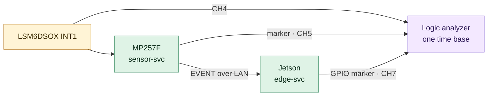

# Test plan
Status: Bản nháp. Mỗi test khi chạy thật ghi kết quả và evidence theo [quy tắc evidence](../README.md#evidence); test nào chưa chạy giữ trạng thái Not run.

Test độ bền và bảo mật được thêm **cùng lúc** với tính năng tạo ra rủi ro, không dồn về cuối project: service đầu tiên đã có test crash, timeout, restart và cleanup; bắt đầu ghi dữ liệu thì có test đầy ổ đĩa và cắt nguồn; làm OTA thì kiểm chữ ký image trong cùng milestone. Test của bước trước phải vẫn pass ở mọi bước sau.

## Mức test
| Mức | Chạy ở đâu | Công cụ | Khi nào |
| --- | --- | --- | --- |
| Unit | Host, CI | Unity hoặc CMocka (C), GoogleTest (edge-svc), libFuzzer + sanitizer | Mỗi commit |
| Integration | MP257F + laptop (rx-host) trên LAN lab; thêm Jetson từ 04/2027 | pytest qua SSH/serial, rx-host ở chế độ lỗi, tshark, iperf3, tc netem | Mỗi milestone, trước khi merge thay đổi lớn |
| System | Toàn bộ hệ thống + camera | pytest, logic analyzer, ffprobe | Từ 05/2027 |
| Fault injection | Bench | `kill`, `kill -STOP`, rx-host ở chế độ lỗi, rút cáp, `fallocate`, USB relay | Từ skeleton 12/2026, thêm theo từng tính năng |
| Đo lường | Bench | Script đo của R04: latency, mẫu mất, CPU, RSS | Mỗi milestone; so với baseline 12/2026 |
| Endurance | Bench | Script chạy dài, thu counter | 1 giờ ở 12/2026 (baseline), 24 giờ ở 05/2027 |

## Ma trận test
Cột Mốc là tháng test chạy lần đầu; từ đó test chạy lại ở mọi milestone.

| ID | Mức | Kịch bản | Req | Tiêu chí pass | Mốc | Chạy | Kết quả |
| --- | --- | --- | --- | --- | --- | --- | --- |
| T-U01 | Unit | Codec round-trip mọi loại message + test vector trong [protocol](protocol.md#test-vectors) | R02 | Khớp từng byte | 12/2026 | CI | Not run |
| T-U02 | Unit | Frame lỗi: cắt ngắn, sai magic, sai CRC, version lạ, payload_len quá lớn | R02 | Bị từ chối, counter đúng, không crash | 12/2026 | CI | Not run |
| T-U03 | Unit | Frame bị cắt ở mọi vị trí; nhiều frame dính nhau trong một lần đọc | R20 | Decoder ghép đúng mọi trường hợp, không đọc quá buffer (ASan sạch) | 12/2026 | CI | Not run |
| T-U04 | Unit | Fuzz decoder | R02 | 10 phút trong CI và 8 giờ ở local không crash, ASan sạch | 01/2027 | CI + local | Not run |
| T-U05 | Unit | Outbox: đầy, ACK, gửi lại theo thứ tự (fake clock) | R03 | Thứ tự đúng, `events_dropped` đúng | 01/2027 | CI | Not run |
| T-U06 | Unit | Replay dataset IMU qua detector (nguồn mẫu `replay`) | R06 | Đúng danh sách event mong đợi; ngưỡng báo nhầm chốt sau khi có dataset | 01/2027 | CI | Not run |
| T-U07 | Unit | edge-svc: receiver (validate, chống trùng, ACK) và storage (rename nguyên tử, retention) bằng GoogleTest | R02, R15 | Pass trên host, ASan/UBSan sạch | 04/2027 | CI | Not run |
| T-I01 | Integration | Rút rồi cắm lại dây cảm biến khi đang chạy | R01 | Có log lỗi, tự phục hồi, service không restart | 01/2027 | Bench | Not run |
| T-I02 | Integration | Rút cáp Ethernet trong lúc tạo 5 event, cắm lại | R03 | Đủ 5 event, seq liên tục, không trùng | 01/2027 | Bench | Not run |
| T-I03 | Integration | rx-host ở từng chế độ lỗi: `--byte-by-byte`, `--slow`, `--stop-reading 60`, `--close-mid-frame`, `--no-ack` | R03, R20 | Vòng lấy mẫu không bị block; RSS không tăng; counter khớp với lỗi đã tiêm; reconnect sau timeout | 12/2026 (ba chế độ đầu), 01/2027 (đủ) | Bench | Not run |
| T-I04 | Integration | Script đo: không tải, có tải iperf3, có `tc netem` loss 1% và delay 20 ms | R04 | Có báo cáo p50/p99, mẫu mất, CPU, RSS cho từng cấu hình, đặt cạnh baseline | 01/2027 | Bench | Not run |
| T-I05 | Integration | mTLS với certificate đúng, sai CA, hết hạn, không có client certificate | R05 | Chỉ certificate đúng kết nối được; lỗi có log | 04/2027 | Bench | Not run |
| T-I06 | Integration | Unbind/bind driver IIO tự viết khi sensor-svc đang chạy | R01 | sensor-svc báo lỗi, tự mở lại device khi driver quay lại | 02/2027 | Bench | Not run |
| T-S01 | System | Gõ/lắc cảm biến 20 lần | R06 | 20 clip đủ 10 s + 20 s, `sha256sum -c` khớp, ffprobe không lỗi | 05/2027 | Bench | Not run |
| T-S02 | System | Latency INT1 → edge-svc, 100 event | R07 | p99 ≤ 50 ms (budget ban đầu) | 05/2027 | Bench | Not run |
| T-S03 | System | Lệch đồng hồ hai board qua sync GPIO | R08 | Có số đo; giá trị khớp với `clock_offset_ms` trong metadata | 05/2027 | Bench | Not run |
| T-F01 | Fault | `kill -9` và `kill -STOP` từng service | R10 | Chạy lại trong ≤ WatchdogSec + RestartSec; event đã ACK không mất | 01/2027 (sensor-svc), 04/2027 (edge-svc) | Bench | Not run |
| T-F02 | Fault | Cắt nguồn Jetson khi đang ghi | R11 | 0 file đã đóng bị hỏng; mọi `.partial` được phát hiện | 04/2027 (100 vòng, luồng IMU), 05/2027 (500 vòng, có clip) | Bench | Not run |
| T-F03 | Fault | Storage đầy khi đang ghi | R15 | Service không crash; xóa đúng thứ tự; có cảnh báo; không xóa dữ liệu chưa gửi | 04/2027 | Bench | Not run |
| T-F05 | Fault | Frame rác và frame lỗi gửi vào cả hai phía: script gửi vào cổng 5000 của receiver; rx-host `--send-garbage` gửi ngược về sensor-svc | R02, R16 | Bị từ chối; counter khớp số frame lỗi đã gửi; không crash | 01/2027 (sensor-svc), 04/2027 (edge-svc) | Bench | Not run |
| T-F06 | Fault | Shutdown: SIGTERM khi đang gửi và khi link đang Backoff; lặp 100 lần | R21 | Thoát trong ≤ 2 s; không frame dở; số fd và RSS trước/sau như nhau; ASan sạch trên host | 12/2026 (sensor-svc), 04/2027 (edge-svc) | Bench + CI | Not run |
| T-E01 | Endurance | Chạy liên tục, event ngẫu nhiên mỗi 5 phút | R03, R10, R16 | Memory và số fd không tăng dần; counter khớp | 12/2026 (1 giờ), 05/2027 (24 giờ) | Bench | Not run |
| T-P01 | Privacy | Quét log và metadata của một phiên test | R17 | Không có MAC, serial, IP ngoài LAN lab | 12/2026 | CI + bench | Not run |
| T-SEC01 | Security | Quyền chạy: user của process, ghi ngoài `ReadWritePaths`, mở cổng lạ, điểm `systemd-analyze security` | R18 | Không process nào chạy bằng root; ghi ngoài vùng cho phép bị từ chối; điểm được ghi lại | 12/2026 (không root), 01/2027 (sandboxing) | Bench | Not run |
| T-SEC02 | Security | Review threat model: mỗi mitigation có test, mỗi test còn pass | R19 | Không còn ô trống trong bảng mitigation ↔ test | 12/2026, mỗi milestone | Review | Not run |
| T-B01 | Build | Clone sạch, build và chạy unit test theo README | R14 | CI xanh; người khác làm theo README được | 12/2026 (CI), 06/2027 (clean clone) | CI | Not run |
| T-B02 | Build | Build lại image Yocto từ đầu; boot; skeleton chạy và qua T-I04 | R14 | Image boot, service sẵn sàng, số đo trong khoảng của baseline | 03/2027 | Bench | Not run |
| T-F04 *(mở rộng)* | Fault | Cài image OTA sai chữ ký; cài image lỗi cố ý | R12 | Image sai chữ ký bị từ chối; image lỗi tự rollback về bản trước | 07/2027 | Bench | Not run |
| T-M01 *(mở rộng)* | System | Jitter lấy mẫu M33 so với đường IIO | R13 | Có biểu đồ jitter hai phương án | 08/2027 | Bench | Not run |
| T-S04 *(could)* | System | Detection GPU → LED | R09 | Có số đo latency, ghi vào báo cáo | Mở rộng | Bench | Not run |

## Đo latency INT1 → edge-svc (T-S02)

1. edge-svc bật GPIO marker ngay khi nhận và validate xong một EVENT; sensor-svc bật marker MP257F (CH5) khi phát hiện event.
2. Logic analyzer ghi CH4 (INT1), CH5 và CH7 trên cùng một thang thời gian, nên kết quả không phụ thuộc đồng bộ đồng hồ.
3. Tạo ≥ 100 event; ghép mỗi cạnh CH7 với cạnh INT1 của mẫu đã kích hoạt event (theo timestamp mẫu trong log).
4. Báo cáo p50, p95, p99, max cho từng đoạn (INT1 → CH5, CH5 → CH7); lưu capture `.sr` và script phân tích trong evidence.

Trước khi có Jetson (12/2026–03/2027), baseline chỉ gồm đoạn INT1 → CH5 trên MP257F; đoạn mạng tới rx-host đo bằng timestamp hai phía sau khi laptop đồng bộ chrony với board.

## Đo lệch đồng hồ (T-S03)
1. sensor-svc bật sync GPIO mỗi 10 s và ghi `t_mp2` (CLOCK_REALTIME) ngay sau khi bật.
2. Jetson nhận cạnh lên (ngắt GPIO) và ghi `t_jn`.
3. Lệch ≈ `t_jn − t_mp2 − độ trễ ngắt`; độ trễ ngắt đo riêng bằng logic analyzer (CH6 so với marker phía Jetson).
4. So sánh với `chronyc tracking` của hai board và với `clock_offset_ms` trong metadata.

## Test mất điện (T-F02)
1. Host bật relay cấp nguồn Jetson, chờ HEARTBEAT của edge-svc.
2. 04/2027: edge-svc đang ghi luồng IMU từ sensor-svc. Từ 05/2027: host gửi thêm một EVENT kiểm thử qua cổng test của edge-svc (chỉ có trong build test, không có trong build chạy thật) để recorder bắt đầu ghi.
3. Cắt nguồn tại thời điểm ngẫu nhiên trong 0–30 s.
4. Sau khi boot lại: kiểm tra mọi file và clip không có hậu tố `.partial` (`sha256sum -c`, `ffprobe`, đọc hết CSV); đếm `.partial` được phát hiện.
5. 100 vòng ở 04/2027, 500 vòng ở 05/2027 (mỗi vòng khoảng 2 phút, chạy qua đêm); ghi CSV kết quả từng vòng vào evidence.

Rủi ro: rootfs Jetson có thể hỏng sau nhiều lần mất điện; chuẩn bị thẻ dự phòng và ghi riêng số lần hỏng rootfs như một kết quả.

## Fault injection khác
| Lỗi | Cách tiêm |
| --- | --- |
| Receiver chậm, treo, đóng giữa frame, không ACK | rx-host `--slow`, `--stop-reading`, `--close-mid-frame`, `--no-ack` |
| Partial write thường xuyên | sensor-svc với `SO_SNDBUF` nhỏ; rx-host `--byte-by-byte` |
| Mạng chậm, mất gói | `tc qdisc add dev eth0 root netem delay 20ms loss 1%` trên MP257F |
| Tải mạng | `iperf3` giữa host và board trong lúc test |
| Service treo | `kill -STOP <pid>` để watchdog phát hiện |
| Service chết | `kill -9 <pid>` |
| Storage đầy | `fallocate -l <size> /var/lib/edgecap/fill.bin` |
| Frame lỗi | Script Python gửi frame sai magic, sai CRC, cắt ngắn; rx-host `--send-garbage` cho chiều ngược |
| Cảm biến mất kết nối | Rút dây SDA hoặc INT1 (tắt nguồn trước khi cắm lại nếu cần); unbind driver |

## Tiêu chí vào/ra mỗi phần
| Phần | Vào | Ra |
| --- | --- | --- |
| Skeleton v0 (12/2026) | LSM6DSOX chạy qua IIO với `st_lsm6dsx`; threat model v0 đã viết | T-U01–T-U03, T-I03 (ba chế độ đầu), T-F06, T-P01, T-SEC01 (không root), T-SEC02 Pass; baseline T-E01 1 giờ |
| Skeleton v1 (01/2027) | Skeleton v0 ra | Thêm T-U04–T-U06, T-I01, T-I02, T-I03 (đủ), T-I04, T-F01, T-F05, T-SEC01 (sandboxing) Pass |
| Driver tự viết (02/2027) | Lab [IIO subsystem](../../../linux-kernel/iio-subsystem/README.md) ở L2 | Mọi test trước Pass với driver mới; T-I06 Pass; T-I04 so với baseline |
| Image Yocto (03/2027) | Layer build được | Mọi test trước Pass trên image; T-B02 Pass → Cổng 1 |
| Jetson (04/2027) | Cổng 1 đạt; Jetson boot ổn định | Thêm T-U07, T-I05, T-F02 (100 vòng), T-F03; T-F01, T-F05, T-F06 cho edge-svc; T-SEC02 cập nhật |
| Camera (05/2027) | edge-svc ổn định | Thêm T-S01–T-S03, T-F02 (500 vòng), T-E01 (24 giờ) |
| Ổn định (06/2027) | Không thêm tính năng | Toàn bộ test Must chạy lại từ clean clone; T-B01 Pass → Cổng 2 |
| Mở rộng (07–08/2027) | Cổng 2 đạt | T-F04 Pass trong cùng milestone OTA; T-M01, T-S04 nếu làm phần tương ứng |

## Báo cáo
Mỗi lần chạy: lệnh, commit, cấu hình board, kết quả từng test ID, đường dẫn evidence. Cập nhật cột Kết quả ở trên và cột Result của [requirements](../README.md#requirements).
