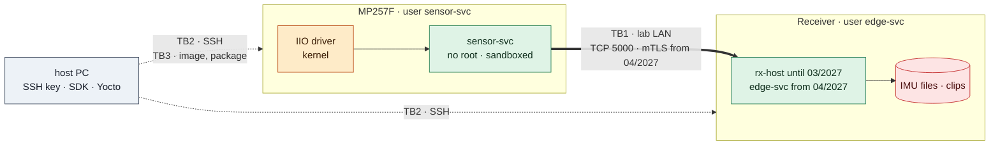

# Threat model
Status: v0, bản nháp chưa review. Viết cùng thiết kế skeleton (12/2026), trước khi code; cập nhật ở mỗi bước của đường chính và khi làm OTA. Mỗi biện pháp giảm thiểu phải có test trong [test plan](test-plan.md) (R19).

## Phạm vi và giả định
- Hệ thống nằm trong LAN lab riêng 192.168.50.0/24, không nối Internet.
- Kẻ tấn công giả định: một thiết bị lạ cắm được vào switch, hoặc một lỗi trong service bị khai thác bằng input từ mạng.
- Ngoài phạm vi cho tới phần mở rộng: người có quyền vật lý mở board hoặc đọc microSD, tấn công kênh phụ, chuỗi cung ứng của SDK và JetPack.

| Tài sản | Cần bảo vệ |
| --- | --- |
| Dữ liệu IMU và event | Toàn vẹn, không mất event đã phát hiện |
| Clip và metadata | Toàn vẹn, không mất clip đã đóng |
| Key và certificate của thiết bị (từ 04/2027) | Bí mật |
| Service | Sẵn sàng: không treo, không crash vì input lạ |
| Phần mềm trên board | Chỉ chạy image và package đã build từ repo |

## Data flow và trust boundary

TB1: mạng lab, coi là không tin cậy. TB2: quản trị qua SSH bằng key, không dùng mật khẩu. TB3: đường đưa phần mềm lên board — deploy tay qua SSH trên đường chính, OTA có ký image ở phần mở rộng.

## STRIDE
| ID | Loại | Mối đe dọa | Biện pháp | Có từ | Test |
| --- | --- | --- | --- | --- | --- |
| TH01 | Spoofing | Thiết bị lạ giả làm sensor-svc, gửi event giả | mTLS, mỗi thiết bị một client certificate từ CA riêng của lab | 04/2027 | T-I05 |
| TH02 | Spoofing | Thiết bị lạ giả làm receiver, trả ACK giả để event bị xóa khỏi outbox | sensor-svc kiểm certificate của server theo CA riêng | 04/2027 | T-I05 |
| TH03 | Tampering | Sửa frame trên đường truyền | CRC-32 chỉ bắt lỗi ngẫu nhiên; TLS bảo vệ toàn vẹn từ 04/2027 | 12/2026, 04/2027 | T-U02, T-I05 |
| TH04 | Tampering | Frame dị dạng làm crash hoặc ghi tràn decoder | Validate theo thứ tự, giới hạn `payload_len`, không cast buffer sang struct; fuzz + ASan | 12/2026 | T-U02, T-U03, T-U04, T-F05 |
| TH05 | Tampering | Sửa clip hoặc metadata sau khi ghi | `SHA256SUMS` cho mỗi clip; ký clip là phần mở rộng | 05/2027 | T-S01 |
| TH06 | Tampering | Dùng cổng test của edge-svc để kích hoạt ghi giả | Cổng test chỉ có trong build test (flag lúc biên dịch); kiểm build chạy thật không mở cổng này | 05/2027 | T-SEC01 |
| TH07 | Tampering | Image hoặc package bị thay trên đường deploy | Đường chính: deploy qua SSH key trong LAN lab, ghi checksum. Mở rộng: image OTA được ký, image sai chữ ký bị từ chối ngay trong milestone OTA; secure boot sau đó | 07/2027 | T-F04 |
| TH08 | Repudiation | Không lần lại được event đến từ đâu, lúc nào | event_id + device_id trong log hai phía; journald persistent | 01/2027 | T-I02 |
| TH09 | Information disclosure | Log hoặc metadata lộ MAC, serial, IP khi publish evidence | device_id ngẫu nhiên; script quét log | 12/2026 | T-P01 |
| TH10 | Information disclosure | Process khác đọc được key của thiết bị | Key quyền 0600 thuộc user của service; `ProtectHome`; OP-TEE là phần mở rộng | 04/2027 | T-SEC01 |
| TH11 | Denial of service | Receiver chậm hoặc treo làm sensor-svc block hoặc dùng hết bộ nhớ | Socket non-blocking, tx queue cố định, timeout gửi, outbox có giới hạn | 12/2026 | T-I03, T-E01 |
| TH12 | Denial of service | Kết nối rác hoặc flood vào cổng 5000 | Giới hạn số kết nối, timeout HELLO, đóng kết nối khi frame lỗi | 04/2027 | T-F05 |
| TH13 | Denial of service | Storage đầy | Retention, xử lý `ENOSPC`, cảnh báo qua HEARTBEAT | 04/2027 | T-F03 |
| TH14 | Elevation of privilege | Lỗi trong service bị khai thác để lấy root | Không chạy bằng root; user riêng; `NoNewPrivileges`, `CapabilityBoundingSet=` rỗng, `ProtectSystem=strict`, `DeviceAllow`; phần cần quyền (bật kênh IIO) tách thành `ExecStartPre=+` | 12/2026, 01/2027 | T-SEC01 |

## Quyền chạy
| Process | User | Được phép | Không có |
| --- | --- | --- | --- |
| sensor-svc | `sensor-svc`, group `edgecap` | Đọc `/dev/iio:device*` (udev rule), TCP ra cổng 5000, ghi `/var/lib/edgecap` | Root, capability, ghi `/etc` và `/usr`, nạp module |
| iio-setup | root, chạy một lần trước service | Ghi sysfs của IIO device | Mạng, chạy lâu dài |
| edge-svc | `edge-svc`, group `edgecap` | Nghe TCP 5000, dùng camera và GPIO marker, ghi `/var/lib/edgecap` | Root, capability |
| rx-host | User thường trên laptop | Nghe TCP 5000 trong LAN lab | Quyền quản trị |

Quyền cụ thể cho camera và GPIO trên JetPack 4.6 kiểm lại khi bring-up Jetson và ghi vào bảng này.

## Rủi ro chấp nhận tạm
- 12/2026–03/2027: kênh TCP chưa mã hóa và chưa xác thực (TH01–TH03); chỉ chạy trong LAN lab riêng. mTLS ở 04/2027 là điều kiện của Cổng 2.
- Tới phần mở rộng 07/2027: chưa có secure boot, rootfs chưa chỉ đọc, key nằm trên filesystem; người có quyền vật lý vượt qua được.

## Cập nhật theo mốc
| Mốc | Thay đổi phải xét |
| --- | --- |
| 12/2026 | v0 cho skeleton: TH03, TH04, TH09, TH11, TH14 |
| 01/2027 | systemd + sandboxing, ACK + outbox: TH08, TH14 |
| 04/2027 | Jetson, mTLS, bắt đầu ghi dữ liệu: TH01, TH02, TH10, TH12, TH13 |
| 05/2027 | Recorder, clip, cổng test: TH05, TH06 |
| 07/2027 (mở rộng) | OTA có ký image, secure boot: TH07 |

| Ngày review | Phiên bản | Thay đổi |
| --- | --- | --- |
| — | v0 | Bản nháp, chưa review |
